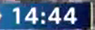

# Naive Way to Sync Match Footage and Event Data


If you've used Wyscout you probably know all about their excellent curated playlists. You can get all of Ibrahim Sangaré's progressive passes for the entire season or you can check all of Adama Traoré's carries into the final third. It's an invaluable resource for analysts and coaches who do not have to watch entire matches when they just care about some select parts and it saves them a ton of time. 

However, Wyscout is costly. Which got me thinking that if there were an open source tool to do almost the same thing but for no cost, what would that look like and how would it work. Probably the easiest way to do this would be to get event data (~~which is mostly free if you know where to look~~) to power it. You'll need full match recordings but those aren't very hard to find either - especially with excellent resources like [footballia](https://footballia.net/). 

There's just a small catch. Just having both(video and event data) doesn't immediately set you up for the good stuff. Most match recordings have some filler at the beginning - pre-match presentations, lineup display, toss - all of those happen before the kick-off. This is a problem because our ***footage starting point does not lineup with our event data feed starting point***.

If we can figure out at what point exactly in our footage the match kicks off, we're good to go. The simplest way to do that is probably to just detect the match clock (the ones usually in the top left corner-near the scoreline and team names). Once we have that, we can use some computer vision magic to recognize the timestamp, read it, discard the parts of the video before that and that should automatically do the trick. In this post, we're going to attempt to do exactly that. 


*The Match Clock/Match Timestamp*

[Here](https://github.com/sharmaabhishekk/random_stuff/blob/master/automate_touch_compilation/main.py)'s the code for this post in case you want to skip the rest of the write-up. 

## Data 

We're going to work with the **FIFA 2018 WC final(France vs Croatia)**. I use this because we can use the [**Statsbomb Open Data**](https://github.com/Statsbomb/open-data) to get our event data. The full match footage is also available on [footballia](https://footballia.net/) - downloading it is easy enough if you have the right chrome extensions or know your way around the site DOM.   

Before we start coding, here's what my file structure looks like. 

```python
video_event_data_sync
|
├── footage
│   ├── France_Croatia_1.mp4 
│   └── France_Croatia_2.mp4 
├── out
├── src
│   └── main.py
├── timestamps
```
* **footage**: folder with both the halves of the match in two separate `.mp4` files. This is important. 
* **out**: directory where the generated video is going to be saved
* **src**: python magic
* **timestamps**: where we'll save the video timestamp corresponding to the actual kick-off time in a `.txt` file. 

As we run our code, we can expect to see the `out` and `timestamps` directories fill up.

## Simplifying Assumptions

We need to make certain assumptions even before we write our first line of code. Here are the important ones:

* ***Each half of the game is a separate file***: This is kinda important since the clock resets from 45 minutes after half-time. Although, the first half is supposed to be only 45 minutes, it rarely ever is and it always extends a few more minutes. So basically, in all matches, the timestamp *46th minute* can occur twice. This kinda messes things up a little for us(because the timestamps cease to be unique) so the easiest fix is to just treat both halves as two separate entities. 

* ***The clock in the footage is prominent and the separator between the minutes and seconds is a colon(:)***: Again, we need the timestamp to infer the time so this part is very essential. Also, most time formats are like **MM:SS** which is why the choice of the colon makes sense but if it doesn't use a column or if the clock format is such that the clock resets from 00:00 for *each* half (I swear I'm not making this up, I've seen this a couple times in the MLS), this naive version is going to fail. 

## Getting Started

### Prerequisites

In terms of external libraries, all we need are:

* **OpenCV2**: Selecting our RoI and other preprocessing steps on the footage frames
* **Pandas**: For querying the event data
* **Moviepy**: Video manipulation (trimming, concatenating etc)
* **PyTesseract**: For detecting the timestamp digits in the image

(*For pytesseract to work, you'll need [tesseract](https://github.com/tesseract-ocr/tesseract) installed*)

### Recognizing the timestamp

Identifying the current time in the match from the footage is really the biggest concern for us. Taking care of this is going to make everything else seem trivial. At any rate, we also have the option to just skip this step entirely. If the user(analyst/coach) can provide the exact timestamp(correct to a second) of the kick-off moment from the video, this step becomes superfluous. Nonetheless, keeping this in gives us more scope for automation in the future. 

```python
##imports
import os ##basic houseeeping stuff
import json ##for reading in the Statsbomb data
import argparse ##for the CLI

import cv2
from PIL import Image
import pytesseract ##wrapper for tesseract; make sure you have tesseract installed

from pandas import json_normalize
from moviepy.editor import VideoFileClip, concatenate_videoclips
```

```python
def save_kickoff_time():

    """ Only run when text file not found
    """

    vid.set(cv2.CAP_PROP_POS_MSEC,clip_time_min*60_000) 
    success, image = vid.read()

    ## Select ROI
    r = cv2.selectROI(image, False)
        
    ## Crop image
    cropped_im = image[int(r[1]):int(r[1]+r[3]), int(r[0]):int(r[0]+r[2])]
    cropped_im = cv2.medianBlur(cropped_im, 3)
    im_pil = Image.fromarray(cropped_im)
    text = pytesseract.image_to_string(im_pil, config='--psm 6')

    m, s = text.strip().split(':')
    m, s = int(m), int(s)
    print(f'Detected time: {m} mins and {s} secs')

    cv2.imshow('Selected', cropped_im)
    cv2.waitKey(0)

    with open(fr'..\timestamps\{fname}.txt', 'w') as f:
        f.write(str((clip_time_min - (m+s/60))*60_000)) ##save our time in milliseconds
```

In our `save_kickoff_time` function, we basically read in the video file, seek directly to a certain time mark(20 minutes is the default), ask the user to draw a rectangle around the clock in the frame, and then save the detected timestamp at that frame in our `timestamps` directory in a `.txt` file. We save it with the same name as our video file so that the next time we try to sync this video, we can just read in the text file and skip this step (alternatively, you can just modify the `.txt` file yourself). 

In the next two functions, we'll write a couple simple functions to load in the Statsbomb JSON file as a dataframe and then use that dataframe to get our event timestamps.

```python
def get_event_data(match_id):
    with open(fr'C:\repository\open-data\data\events\{match_id}.json', 'r') as f:
        md = json.load(f)
    df = json_normalize(md, sep='_')
    df['loc_x'] = df['location'].apply(lambda val: np.nan if val!=val else val[0])
    df['loc_y'] = df['location'].apply(lambda val: np.nan if val!=val else val[1])

    return df.drop('location', axis=1)
```

```python
def return_events_ts(df, query_str):
    """Takes in the events dataframe, runs the given query and then returns the matching timestamps converted to seconds"""
    pdf = df.query(query_str)

    return (pdf['minute']*60 + pdf['second']).values
```

### Cutting and Concatenating Event Clips

We have a way to get timestamps matching arbitrary events from the Statsbomb event file. The next step is to use those timestamps and the kick-off time we worked out earlier to hopefully get to the exact times certain events were being performed in the footage and compile them together in a list. 

```python
def join_and_save_video(timestamps, gap=2.5):
    if len(timestamps)>0:

        ko_sec_ts = ko_millisec_ts/1000
        
        clip = VideoFileClip(fr'..\footage\{filename}')
        clip_list = [clip.subclip(t+ko_sec_ts-gap, t+ko_sec_ts+gap) for n,t in enumerate(timestamps)]    

        video = concatenate_videoclips(clip_list, method='compose')
        video_outname = "".join(i for i in query_str if i not in "\/:*?<>|")
        video.write_videofile(fr'..\out\{video_outname}.mp4', threads=4, audio=False)
        print('All done!')
    else:
        print('There are no events which match your query. Maybe try a different query?') 
```

### Specifying the workflow

Once all the functions are defined, we just need to tie them together in the body of the script. We'll use `argparse` to convert this into a *functional* command line utility.

```python
if __name__ == '__main__':

    if not os.path.exists(fr'..\timestamps'):
        os.mkdir(fr'..\timestamps')

    if not os.path.exists(fr'..\out'):
        os.mkdir(fr'..\out')

    parser = argparse.ArgumentParser(description='Automate Touch Compilation')
    parser.add_argument('-v', '--video_filename', type=str, help='The name of the match video in the footage directory.', required=True)
    parser.add_argument('-e', '--event_matchid', type=int, help='The name of the match_id/file_name for the Statsbomb JSON file.', required=True)
    parser.add_argument('-q', '--query', type=str, help='The pandas query to run to filter the timestamps', required=True)
    parser.add_argument('-t', '--video_timestamp', type=int, help='The video time to use to infer the match clock. Make sure this frame has the clock prominently displayed', required=True, default=20)

    args = parser.parse_args()    

    filename = args.video_filename
    fname, fext = os.path.splitext(filename)

    clip_time_min = args.video_timestamp ##ensure this time is at least some frame of the game where the timestamp is visible
    vid = cv2.VideoCapture(fr'..\footage\{filename}')

    if not os.path.exists(fr'..\timestamps\{fname}.txt'):
        save_kickoff_time()

    with open(fr'..\timestamps\{fname}.txt', 'r') as f:
        ko_millisec_ts = float(f.read())

    df = get_event_data(args.event_matchid)
    query_str = args.query 
    timestamps = return_events_ts(df, query_str)
    print(len(timestamps))
    join_and_save_video(timestamps)

```

A quick run-through of what's happening: We first make sure the correct directories exist. Then we ask the user for the filenames for both the video and the event data, the query (say something like all of Modrić's passes from the first half). We next check if a timestamp text file exists for this particular video - if it doesn't we run our `save_kickoff_time` function to create that text file. Next step is to run the query and pass along the results of that to the `return_events_ts` function. The timestamps we get from there, we pass to the `join_and_save_video` function. That function first seeks the video directly to the kick-off time we inferred earlier. Then for each event timestamp, it cuts a short part *around* it and saves it in a list. Finally, it compiles all the clips in the list and saves the resulting video. If everything works well, this is our final result. 

### Testing 

Let's give this a spin. Want to see all of Pogba's passes from the first half? Here you go:

```python
$ python main.py -v 'France_Croatia_1.mp4' -e 8658 -t 20 -q "player_name == 'Paul Pogba' & type_name == 'Pass' & period == 1"   
```


Maybe all pressures by Croatia in France's half of the pitch?

```python
$ python main.py -v 'France_Croatia_1.mp4' -e 8658 -t 20 -q "team_name == 'Croatia' & type_name == 'Pressure' & loc_x>= 60 & period == 1"
```


## Current Limitations and Room for Improvement

This is just a bare bones tool and I have no doubt clubs and organizations use a much more robust, way more beefed-up version. There are tons of possible things to improve on and lots of edge cases which can (and will) creep in. A couple important, more pertinent, ones are:

1.) ***Tesseract*** doesn't always work. It's not an off-the-shelf solution (even though I have used it as such here). Different match footages, different aesthetics, different fonts, different resolutions, and probably even different backgrounds - any of those can get the time recognition part to break. The configuration I chose just seemed to work best but there's no guarantee. For more reliable production purposes, you'd almost certainly want a more sophisticated/robust tool.

Combine that with the fact that I want to fully automate the process of detection, i.e., not having the analyst to draw the box themselves either and this gets even tougher because then the detection would have to work on a much larger image. 

2.) How do I deal with matches where both halves are in the same `.mp4` file? 

3.) A potential idea is to turn this whole thing into a GUI. It doesn't make much sense as a command line utility - from personal experience, analysts usually like to *see* things happening. 
 
_______________________

Nonetheless, I hope this was helpful in some manner! Huge thanks to Statsbomb for the freely available event data and footballia for the free video library! Also, as I'm no expert on software development, there might have been parts where I didn't know what I was talking about. If you want to call me out, or have some other kind of feedback(suggestions/questions), I'm always on twitter. Feel free to drop me a DM!