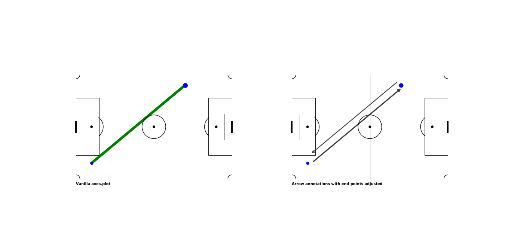
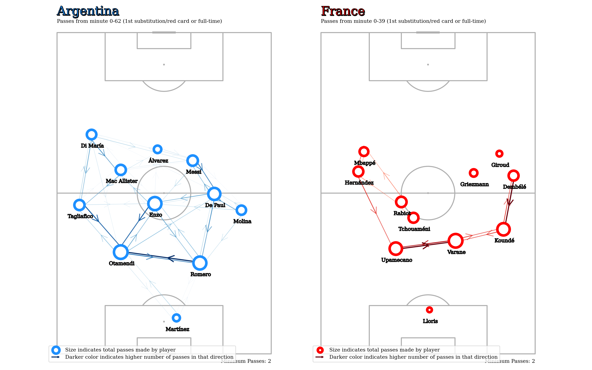

# Creating Passmaps in Python

**Edit (17/03/2022)**: *This post from 2020 is the oldest post from this site and somehow also the most popular. Unfortunately, a lot of the code was outdated so I decided to update this post.*

Passmaps or passing networks are one of the most popular visualizations in football. And probably for good reason. If I could pick a single graphic to tell the match story, I'd probably pick a (well-made) passmap. 

They pack a lot of useful information
about a single match in an intuitive manner. Passing trends, networks, players' roles in a given system, and even how well they're performing said roles.

Let's go over creating your own in Python (using Statsbomb's open data).

(If you're just interested in the code, the github link to the notebook is [here](https://github.com/sharmaabhishekk/sharmaabhishekk.github.io/tree/master/notebooks/sb-passmaps.ipynb))

## Pre-requisites

I'm gonna be using Python so you'll need that.

Other than that, we'll also be using the following libraries:

```
pandas     : 1.4.2
statsbombpy: 1.4.3
matplotlib : 3.5.2
numpy      : 1.22.4
mplsoccer  : 1.0.6
```

 All of those should be just a `pip install` away.

## Dataset

To create a passmap for a match, we'll need some event data. Statsbomb have some free [data](https://github.com/statsbomb/open-data). The library `statsbombpy` is useful to access that data.

## Basic Overview

What really is a passmap?


This is the popular version by [11tegen11](https://twitter.com/11tegen11). At first glance, it might seem like there's a lot going on here but
let's take a closer look at what information it's supposed to convey to us, specifically, two main things:

1. the ***average position of the player***, and
2. the ***number of passes*** between any two given players.

(Note: average position doesn't necessarily have to be the mean, in some instances it makes sense to use other aggregations as well - like median)

Apart from that, we also have 
* players' names, and
* players' dot sizes (which indicate the **total number of passes played by the player**).

Finally we have some aesthetic details - match details, watermark, team's logo. For the purpose of this post, we are going to ignore the last two.

(Again, to just check the notebook, find the link [here](https://github.com/sharmaabhishekk/sharmaabhishekk.github.io/tree/master/notebooks/sb-passmaps.ipynb))

## Getting Started

### Imports

 <br>
<details>
<summary class='highlight-text-summary'>
Code cell
</summary>



import numpy as np 
import pandas as pd

# matplotlib libraries

import matplotlib.pyplot as plt
# changed this to just use mplsoccer's pitch module
# from pitch import Pitch ##a helper function to quickly give us a pitch
import matplotlib.patheffects as pe 
from matplotlib.legend_handler import HandlerLine2D
from matplotlib.patches import FancyArrowPatch

from mplsoccer.pitch import VerticalPitch
from adjustText import adjust_text

from statsbombpy import sb

plt.rcParams['font.family'] = 'serif'
plt.rcParams['font.sans-serif'] = 'Palatino Linotype'
 
</details>

<br>

### Loading the data

Statsbomb have a unique `match_id` for every match in the open-data repository. The match we're going to look at is the FIFA WC 2022 Final
between Argentina and France.

<br>
<details>
<summary class='highlight-text-summary'>
Code cell
</summary>



sb.competitions().head(5)

"""
competition_id	season_id	country_name	competition_name	competition_gender	competition_youth	competition_international	season_name	match_updated	match_updated_360	match_available_360	match_available
0	16	4	Europe	Champions League	male	False	False	2018/2019	2023-03-07T12:20:48.118250	2021-06-13T16:17:31.694	None	2023-03-07T12:20:48.118250
1	16	1	Europe	Champions League	male	False	False	2017/2018	2021-08-27T11:26:39.802832	2021-06-13T16:17:31.694	None	2021-01-23T21:55:30.425330
2	16	2	Europe	Champions League	male	False	False	2016/2017	2021-08-27T11:26:39.802832	2021-06-13T16:17:31.694	None	2020-07-29T05:00
"""

sb.matches(competition_id=43, season_id=106).\
    sort_values("match_date", ascending=False).\
    head(1)

"""
match_id	match_date	kick_off	competition	season	home_team	away_team	home_score	away_score	match_status	...	last_updated_360	match_week	competition_stage	stadium	referee	home_managers	away_managers	data_version	shot_fidelity_version	xy_fidelity_version
5	3869685	2022-12-18	17:00:00.000	International - FIFA World Cup	2022	Argentina	France	3	3	available	...	2022-12-21T16:02:21.075183	7	Final	Lusail Stadium	Szymon Marciniak	Lionel Sebastián Scaloni	Didier Deschamps	1.1.0	2	2
"""


</details>

<br>

Next, we'll pick the `match_id` and get all events for it using the `.events` function. It will return a Pandas `dataframe`.

<br>
<details>
<summary class='highlight-text-summary'>
Code cell
</summary>



MATCH_ID = 3869685
df = sb.events(MATCH_ID)
df.head()

"""
50_50	bad_behaviour_card	ball_receipt_outcome	ball_recovery_offensive	ball_recovery_recovery_failure	block_deflection	block_offensive	carry_end_location	clearance_aerial_won	clearance_body_part	...	shot_statsbomb_xg	shot_technique	shot_type	substitution_outcome	substitution_replacement	tactics	team	timestamp	type	under_pressure
0	NaN	NaN	NaN	NaN	NaN	NaN	NaN	NaN	NaN	NaN	...	NaN	NaN	NaN	NaN	NaN	{'formation': 433, 'lineup': [{'player': {'id'...	Argentina	00:00:00.000	Starting XI	NaN
1	NaN	NaN	NaN	NaN	NaN	NaN	NaN	NaN	NaN	NaN	...	NaN	NaN	NaN	NaN	NaN	{'formation': 4231, 'lineup': [{'player': {'id...	France	00:00:00.000	Starting XI	NaN
"""

</details>

<br>

The dataframe `df` contains the lineups for both teams as the first two dictionaries in the column `tactics`.

<br>
<details>
<summary class='highlight-text-summary'>
Code cell
</summary>


print(df.loc[0, 'tactics'])

"""{'formation': 433,
 'lineup': [{'player': {'id': 6909, 'name': 'Damián Emiliano Martínez'},
   'position': {'id': 1, 'name': 'Goalkeeper'},
   'jersey_number': 23},
  {'player': {'id': 29201, 'name': 'Nahuel Molina Lucero'},
   'position': {'id': 2, 'name': 'Right Back'},
   'jersey_number': 26},
   ... 
  {'player': {'id': 29560, 'name': 'Julián Álvarez'},
   'position': {'id': 23, 'name': 'Center Forward'},
   'jersey_number': 9}]}"""

</details>

<br>

This is important, we'll need the names from here.

### Helper Functions for Plotting

Let's write a couple helper functions and Classes to create the arrows to indicate passes and to create an entry for the same in the legend.

<br>
<details>
<summary class='highlight-text-summary'>
Code cell
</summary>



class AnnotationHandler(HandlerLine2D):
    """
    Copied this from https://stackoverflow.com/a/49262926 

    Useful to add a annotation entry to legend since it is not
    automatically added
    """
    def __init__(self,ms,*args,**kwargs):
        self.ms = ms
        HandlerLine2D.__init__(self,*args,**kwargs)
    def create_artists(self, legend, orig_handle,
                       xdescent, ydescent, width, height, fontsize,
                       trans):
        xdata, _ = self.get_xdata(legend, xdescent, ydescent,
                                             width, height, fontsize)
        ydata = ((height - ydescent) / 2.) * np.ones(np.array(xdata).shape, float)
        legline = FancyArrowPatch(posA=(xdata[0],ydata[0]),
                                  posB=(xdata[-1],ydata[-1]),
                                  mutation_scale=self.ms,
                                  **orig_handle.arrowprops)
        legline.set_transform(trans)
        return legline,

def add_arrow(x1, 
              y1, 
              x2, 
              y2, 
              ax,
              **kwargs
              ):
    """
    Helper function to add an arrow b/w two points
    defined by (x1,y1) and (x2, y2)

    A line is drawn from point A to point B. An arrow is then drawn from point A along halfway to point B. This is an easy way to get an arrow with a head in the middle
    """
    ax.plot([x1, x2], 
            [y1, y2], 
            **kwargs)
        
    annotation = ax.annotate("", 
                xytext=(x1, y1), 
                xy=( x1+((x2-x1)/2), 
                         y1+((y2-y1)/2)
                        ),
                arrowprops=dict(arrowstyle="->", **kwargs),
                zorder=10,
                size=30,
                label="Darker color indicates higher number of passes in that direction"
                )
    
    return annotation


</details>

<br>

### Passmap Logic

The passmap logic is essentially just two groupbys.

1. Groupby 1 is used to get the average positions for players' - we can aggregate on the player names and calulate a `mean`/`median` value for `x` and `y`

```python
player_location_df = team_pass_df.\
                         groupby(['player']).\
                         agg(x=('pass_start_x', 'mean'), 
                             y=('pass_start_y', 'mean'),
                             total=('pass_start_x', 'size')
                             ).\
                         reset_index()

"""
                             player          x          y  total
0               Alexis Mac Allister  68.737500  23.845833     24
1           Cristian Gabriel Romero  33.905128  53.346154     39
2          Damián Emiliano Martínez  13.400000  44.663636     11
3                    Enzo Fernandez  56.135000  36.532500     40
4                    Julián Álvarez  76.346154  37.538462     13
5    Lionel Andrés Messi Cuccittini  72.172000  50.708000     25
6              Nahuel Molina Lucero  53.695000  68.920000     20
7      Nicolás Alejandro Tagliafico  55.591667   8.387500     24
8           Nicolás Hernán Otamendi  37.979070  23.820930     43
9            Rodrigo Javier De Paul  59.708824  58.770588     34
10  Ángel Fabián Di María Hernández  81.928571  12.909524     21
"""
```

2. Groupby 2 is used to calculate the number of successful passes between all pairs of players - the starting 11 probably makes the most sense in most cases (except for red cards and early substitutions)

```python
players_passes_df = team_pass_df.\
        groupby(['player', 'pass_recipient']).\
        agg(passes=('pass_start_x', 'size')).\
        reset_index()

"""
                             player                  pass_recipient  passes
0               Alexis Mac Allister                  Enzo Fernandez       6
1               Alexis Mac Allister                  Julián Álvarez       1
..                              ...                             ...     ...
80  Ángel Fabián Di María Hernández                  Julián Álvarez       2
"""
```

Once, we have those two we can loop over the result of groupby 2 and use each player's corresponding average position from groupby 1 to plot an arrow (`passes`).

The following function does exactly all that. 

<br>
<details>
<summary class='highlight-text-summary'>
Code cell
</summary>


def draw_passmap(ax, 
                 team_pass_df,
                 popular_names_dict, 
                 starters, 
                 team_name, 
                 color, 
                 cmap_name):
    
    """
    create a passmap for a single team 
    """

    # get only startering players
    starter_ids = [starter['player']['id'] for starter in starters]
    team_pass_df = team_pass_df.query(f"player_id in {starter_ids}")

    player_location_df = team_pass_df.\
                         groupby(['player']).\
                         agg(x=('pass_start_x', 'mean'), 
                             y=('pass_start_y', 'mean'),
                             total=('pass_start_x', 'size')
                             ).\
                         reset_index()
    
    players_passes_df = team_pass_df.\
        groupby(['player', 'pass_recipient']).\
        agg(passes=('pass_start_x', 'size')).\
        reset_index()
    
    # some pandas merging to get all useful data in a single # df
    players_passes_df = players_passes_df.merge(player_location_df[['player', 'x', 'y']], 
                                        left_on='player', right_on='player').\
                                            rename(columns={'x': 'passer_x', 
                                                            'y': 'passer_y'}
                                                   )

    players_passes_df = players_passes_df.merge(player_location_df[['player', 'x', 'y']], 
                                            left_on='pass_recipient', right_on='player').\
                                                rename(columns={'x': 'recipient_x', 
                                                                'y': 'recipient_y', 
                                                                'player_x': 'player'}
                                                    ) 
    players_passes_df.drop('player_y', axis=1, inplace=True)
    players_passes_df.sort_values("passes", ascending=True, inplace=True)

    ## 
    cmap = plt.cm.get_cmap(cmap_name)
    highest_passes = players_passes_df['passes'].max()
    players_passes_df['passes_scaled'] = players_passes_df['passes']/highest_passes

    annotations = []
    LABEL = True

    for row in players_passes_df.itertuples():
        if row.passes > MIN_PASS_COUNT:

            if abs(row.recipient_y - row.passer_y) > abs(row.recipient_x - row.passer_x):
                if row.player > row.pass_recipient:
                    x_shift, y_shift = 0, ARROW_SHIFT
                else: 
                    x_shift, y_shift = 0, -ARROW_SHIFT
            else:
                if row.player > row.pass_recipient:
                    x_shift, y_shift = ARROW_SHIFT, 0
                else: 
                    x_shift, y_shift = -ARROW_SHIFT, 0

            arrow = add_arrow(x1=row.recipient_y+y_shift, 
                        y1=row.recipient_x+x_shift,
                        x2=row.passer_y+y_shift, 
                        y2=row.passer_x+x_shift,
                        ax=ax, 
                        color=cmap(row.passes_scaled), 
                        alpha=row.passes_scaled,
                        lw=row.passes_scaled*2)
            
            annotations.append(arrow)

    texts = []

    player_location_df.sort_values("total", ascending=True, inplace=True)

    for row in player_location_df.itertuples():
        ax.scatter(row.y, 
                row.x, 
                s=(row.total/player_location_df.total.max())*700,
                fc='white',
                ec=color,
                lw=5,
                zorder=100, 
                label="Size indicates total passes made by player" if LABEL else "" 
                )
        text = ax.text(row.y, 
                    row.x-4, 
                    s=popular_names_dict[row.player], 
                    ha='center', 
                    va='center', 
                    zorder=200)
                
        text.set_path_effects([pe.PathPatchEffect(offset=(2, -2), hatch='xxxx', facecolor='gray'),
                            ])
        texts.append(text)

        LABEL = False
    # use this if you have names getting plotted over each other
    # adjust_text(texts)

    # title
    title = ax.text(0, 
            130, 
            team_name, 
            color = color,
            fontsize=24, 
            zorder=250, 
            va='top',
            )
    
    ax.text(0, 
            125, 
            f"Passes from minute 0-{team_pass_df.minute.max()} (1st substitution/red card or full-time)",
            fontsize=10, 
            va='top', )
    
    ax.text(80, 
            -2, 
            f"Minimum Passes: {MIN_PASS_COUNT}",
            fontsize=10, 
            va='top',
            ha='right',
            )
    
    title.set_path_effects([pe.PathPatchEffect(offset=(1, -1), hatch='xxxx', facecolor='black'),
                            pe.PathPatchEffect(edgecolor='black', linewidth=.8, facecolor=color)
                            ])
    
    # create legend for annotations
    h, _ = ax.get_legend_handles_labels()
    annotate = annotations[-1]

    ax.legend(handles = h +[annotate], 
              handler_map={type(annotate) : AnnotationHandler(5)}, 
              loc=3)

</details>

<br>

Note: This bit was just to ensure we avoid overlaps between our arrows. 

```python
if row.passes > MIN_PASS_COUNT:

            if abs(row.recipient_y - row.passer_y) > abs(row.recipient_x - row.passer_x):
                if row.player > row.pass_recipient:
                    x_shift, y_shift = 0, ARROW_SHIFT
                else: 
                    x_shift, y_shift = 0, -ARROW_SHIFT
            else:
                if row.player > row.pass_recipient:
                    x_shift, y_shift = ARROW_SHIFT, 0
                else: 
                    x_shift, y_shift = -ARROW_SHIFT, 0
```



----

Finally, we'll set up some variables and call our `draw_passmap` function.

<br>
<details>
<summary class='highlight-text-summary'>
Code cell
</summary>


MIN_PASS_COUNT = 2 ##minimum number of passes for a link to be plotted
ARROW_SHIFT = 2 ## units to shift the arrows for pairs of players to ensure no overlaps

# get only open-play successful passes
pass_df = df.query("(type == 'Pass') & \
                    (pass_type not in ['Free Kick', 'Corner', 'Throw-in', 'Kick Off']) & \
                    (pass_outcome not in ['Unknown','Out','Pass Offside','Injury Clearance', 'Incomplete'])"
                   ).reset_index(drop=True)

pass_df[['pass_start_x','pass_start_y']] = pd.DataFrame(pass_df["location"].values.tolist(), 
                                                        index = pass_df.index)
pass_df[['pass_end_x','pass_end_y']] = pd.DataFrame(pass_df["pass_end_location"].values.tolist(), 
                                                        index = pass_df.index)

# makes it easy to get smaller names in the passmaps 
# instead of the full names
popular_names_dict = {"Alexis Mac Allister": "Mac Allister",
                      "Cristian Gabriel Romero": "Romero",
                        "Damián Emiliano Martínez": "Martínez",
                        "Enzo Fernandez": "Enzo",
                        "Julián Álvarez": "Álvarez",
                        "Lionel Andrés Messi Cuccittini": "Messi",
                        "Nahuel Molina Lucero": "Molina",
                        "Nicolás Alejandro Tagliafico": "Tagliafico",
                        "Nicolás Hernán Otamendi": "Otamendi",
                        "Rodrigo Javier De Paul": "De Paul",
                        "Ángel Fabián Di María Hernández": "Di María",
                        "Adrien Rabiot": "Rabiot",
                        "Antoine Griezmann": "Griezmann",
                        "Aurélien Djani Tchouaméni": "Tchouaméni",
                        "Dayotchanculle Upamecano": "Upamecano",
                        "Hugo Lloris": "Lloris",
                        "Jules Koundé": "Koundé",
                        "Kylian Mbappé Lottin": "Mbappé",
                        "Olivier Giroud": "Giroud",
                        "Ousmane Dembélé": "Dembélé",
                        "Raphaël Varane": "Varane",
                        "Theo Bernard François Hernández": "Hernández"
                        }

## idx, color, cmap 
idx_sides = ((0, 'dodgerblue', 'Blues'), 
             (1, 'red', 'Reds')
             )

fig, axes = VerticalPitch().draw(nrows=1, 
                       ncols=2, 
                       figsize=(16,10)
                       )
fig.set_facecolor("white")

for idx, color, cmap in idx_sides:
    starters = df.loc[idx, 'tactics']['lineup']
    team_name = df.loc[idx, 'team']
    team_pass_df = pass_df.query(f"team == '{team_name}'")

    if 'Substitution' in df.type.unique() or 'Red Card' in df.type.unique():
      ending_minute = df.query(f"team == '{team_name}' and type==('Substitution', 'Red Card')").minute.values[0]
    else: 
      ending_minute = team_pass_df.minute.max()

    team_pass_df = team_pass_df.query(f"minute<={ending_minute}")
    draw_passmap(axes[idx], 
                 team_pass_df,
                 popular_names_dict=popular_names_dict,
                 starters = starters, 
                 team_name=team_name,
                 color=color,
                 cmap_name=cmap
                 )


</details>

<br>



One of the advantages of passmaps is that they're fairly customizable. There's a bunch of different things you can try depending on what you're trying to look at. Some examples, 


* Aggregation 
    * Method can be different: median is useful when you have players changing wings.
    * Aggregation period can be different: first half, first 60 minutes, etc. 
    * The players being aggregated could also be different: France had two early subs and hence their passmap is only until the 40th minute. It might make sense to consider a different set of 11 players. How would we go about doing this? Perhaps using Ben Torvaney's window function idea outlined [here](https://www.statsandsnakeoil.com/2020/06/25/how-to-count-minutes-played/)

* Player Nodes - Size could indicate something else other than total passes (xT maybe).
* Could increase/decrease minimum number of passes considered. Could also add other useful metrics.

This is why instead of a static viz, a more interactive thing makes sense, where you can use a bunch of widgets to mess around with all these small things. 

Karun Singh does this and more in his blog post [here](https://karun.in/blog/interactive-passing-networks.html).

____