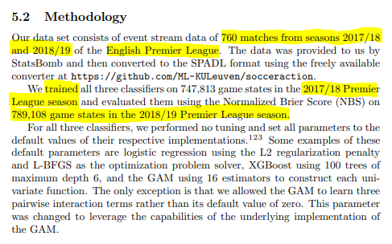
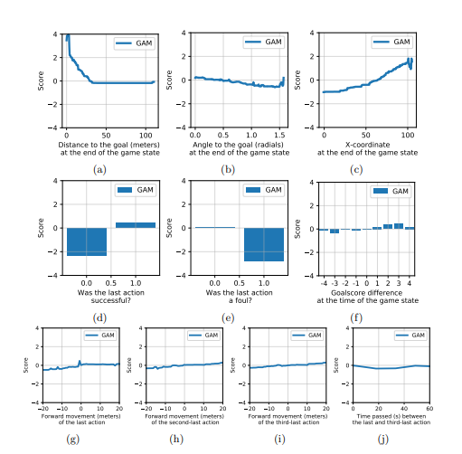
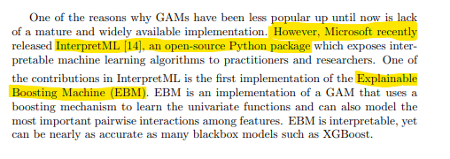
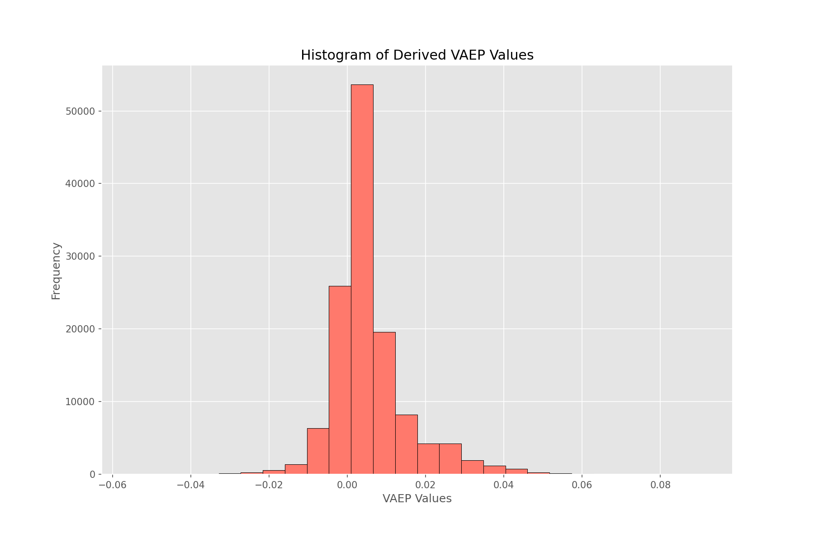
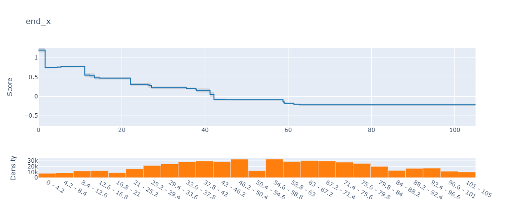
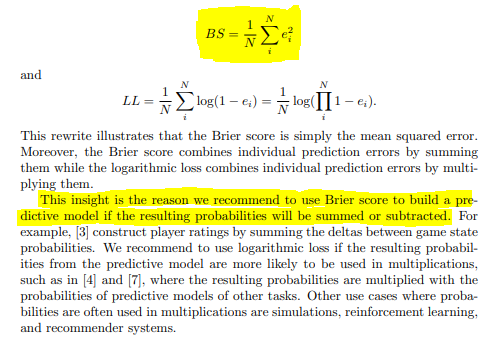
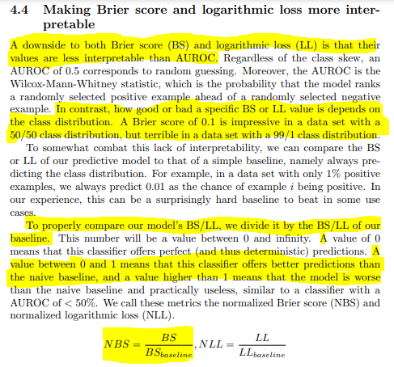
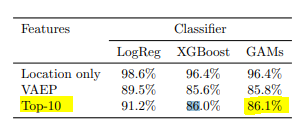

# Paper Implementation: *Interpretable Prediction of Goals in Soccer*

***Valuing Actions*** *by* ***Estimating Probabilities*** (or, **VAEP**) is one of the recent works done to value on-ball actions based on how likely they're to affect the scoreline in the near future. That is, what's the probability of an action to result in a scoring opportunity or a conceding opportunity in the next $n$ actions ($n$=10, typically). While an official implementation for the full model already exists, in this post we'll implement another variant of the model - one based on [Generalized Additive Models](https://en.wikipedia.org/wiki/Generalized_additive_model) 


> Take the above play for example where we can see that Brighton make a mistake in playing out from the back and end up conceding a goal. Davy Pröpper gives away the ball in Brighton's own third due to some great pressing from Naby Keita. Keita then proceeds to set up Mo Salah with a square pass for a relatively simple first-time finish.

Ideally, the framework we have in mind should punish the horrible turnover by Pröpper, and reward the ball regain and subsequent pass by Keita and the shot taken by Salah. The first action is important, because this is (one of the ways) how VAEP is different from xT - it not only rewards "**good**" actions on the ball, it also punishes "**bad**" actions (like being dispossessed in your own third after a bad first touch). 

In the original implementation, the authors use the XGBoost algorithm on a complex feature set to give the probability predictions. However, using the better predictive power of XGBoost also means losing a lot of interpretability. This is kind of a big deal because explaining the model findings and implications to analysts and coaches is imperative. Fortunately enough, the authors have also released a simpler version of VAEP which is trained on only **10 features**. *It is much more explainable, while being almost as good as the complex XGBoost model.* This is the model we'll work out in this post. 


##### Links:
* [**Actions Speak Louder than Goals**](https://www.ijcai.org/Proceedings/2020/0648.pdf) - the original VAEP paper from Tom Decroos, Lotte Bransen, Jan Van Haaren, and Jesse Davis
* [**Interpretable Prediction of Goals in Soccer**](http://statsbomb.com/wp-content/uploads/2019/10/decroos-interpretability-statsbomb.pdf), i.e., the paper we'll implement in this post (from Tom Decroos, and Jesse Davis)
* [**Socceraction**](https://github.com/ML-KULeuven/socceraction): The open-source python library to implement VAEP easily. 

That's enough preamble, let's dive into the code part.


## Prerequisites

I'm assuming you're slightly familiar with the original VAEP paper (check the Links section above). We'll be using Python for this post. The libraries you'll need are:

* matplotlib
* pandas 
* numpy
* sklearn
* [socceraction](https://pypi.org/project/socceraction/)
* [interpret](https://pypi.org/project/interpret/)

We'll need the `socceraction` library to convert the Statsbomb data to [SPADL](https://pypi.org/project/socceraction/#:~:text=SPADL%20Soccer%20Player%20Action%20Description,impact%20on%20the%20score%20line) format. We'll also need `interpretML` to fit the GA2M (basically a GAM but with two interactions allowed).

## Dataset

Here's what the paper says re data used. 



> They trained the model on one season of the Premier League and evaluated it on the next season. 

Since I don't have two seasons worth of data, and the Statsbomb data is probably not enough to train the model fairly well, we'll use two different datasets. I have event data converted into SPADL for around 280 matches for the 2019/20 season. We'll use this to train the model. And then, we'll evaluate the model on the Statsbomb World Cup dataset. 

[***Note**: This method uses two different data providers so although we're converting both to SPADL, there's bound to be some issues regarding the standardisation of the datasets. However, due to a lack of alternatives, this is a limitation I have to accept.*]

## Getting Started

Going from our raw data to final VAEP values involves, broadly, three steps:

1. Converting the raw data to SPADL format
2. Creating our features and labels
3. Training and evaluating our models

### Converting Raw Data to SPADL

We've got two different event datasets to use for our training and validation sets. 

* The **training data** is already converted into SPADL format [here](https://drive.google.com/file/d/1EYovXAXkiHkfcSPx8l-ScnwYw9bN2ZLI/view?usp=sharing). Download it into your working directory. 

* For our **validation data**, we'll convert the World Cup 2018 dataset from Statsbomb. The socceraction repository already has an example notebook to perform the entire conversion and saving steps. All we need to do is to run that notebook.

-----

Firstly, clone the socceraction **public-notebooks** repository. The notebook you want is the first one - ["1-load-and-convert-statsbomb-data.ipynb"](https://github.com/ML-KULeuven/socceraction/blob/master/public-notebooks/1-load-and-convert-statsbomb-data.ipynb) (you could also download just this notebook). I put the notebook inside the same directory where I was working (which looks like this).

```python
vaep_gam_implementation
├── notebooks
│   ├── 1-load-and-convert-statsbomb-data.ipynb 
│   └── create_features_and_labels.ipynb
│   └── modelling_interactML.ipynb
├── preprocessed_data
│   └── train_Xs.csv
│   └── train_ys.csv
│   └── valid_Xs.csv
│   └── valid_ys.csv
├── data-fifa
│   └── spadl-statsbomb.h5
├── xt_pre_data.csv
```  

The next step is to run the notebook. That's as easy as opening the notebook and running all the cells. If everything works well, you'll have a new folder called `data-fifa` in the `vaep_gam` directory. It contains the data from the 64 World Cup matches converted into SPADL format. 

### Creating Labels and Features

The next step is to create training features and labels out of our SPADL data. 

```python
##imports

import pandas as pd
import numpy as np
import os
import tqdm
```

```python
datafolder = "../data-fifa"
spadl_h5 = os.path.join(datafolder, "spadl-statsbomb.h5")
dfs = []
with pd.HDFStore(spadl_h5) as spadlstore:
    games = (
        spadlstore["games"]
        .merge(spadlstore["competitions"], how='left')
        .merge(spadlstore["teams"].add_prefix('home_'), how='left')
        .merge(spadlstore["teams"].add_prefix('away_'), how='left'))
    
    game_ids = games.game_id.unique()
    for game_id in tqdm.tqdm(game_ids):
        actions = spadlstore[f"actions/game_{game_id}"]
        actions = (
                actions.merge(spadlstore["actiontypes"], how="left")
                .merge(spadlstore["results"], how="left")
                .merge(spadlstore["bodyparts"], how="left")
                .merge(spadlstore["players"], how="left")
                .merge(spadlstore["teams"], how="left")
        )
        dfs.append(actions)

valid_df = pd.concat(dfs, ignore_index=True) 
```

This gives us our validation dataset. 

```python
train_df = pd.read_csv("../xt_pre_data.csv")        
```
And this gives us our training dataset. 

____

The GAM described in the paper takes only 10 input features to predict the VAEP values and those are:

* ***distance to goal*** at end of game state
* ***angle to goal*** at end of game state
* ***x-coordinate*** at end of game state
* was ***last action successful***
* was ***last action foul***
* ***goal-score difference*** at end of game-state
* ***forward movement*** of the ***last action***
* ***forward movement*** of the ***second last action***
* ***forward movement*** of the ***third last action***
* ***time*** between the ***last and third last action***



Let's build those features! 

```python
def get_angle(val):
    """Calculate angle from any point to center of goal

    Parameters:
    -----

    val: Tuple(x_coord:Float, y_coord:Float)

    Returns:
    -----

    angle (in radians)
    """
    x1, y1 = 105, 68/2
    x2, y2 = val
    
    dx = x2 - x1
    dy = y2 - y1
    result = np.arctan2(dy, dx)
    return result if result>=0 else result + 2*np.pi
```
The above function calculates the angle between any point and the centre of the goalmouth (at point (105, 34)). In the next function, we will create the rest of the features. 

```python
def get_features_and_labels(df):
    """Creates the 10 features for the GAM and the targets
    
    Parameters:
    -----
    
    df: the SPADL format dataframe
    
    Returns:
    -----
    
    Xs: Dataframe containing the 10 features
    ys: Dataframe containing the 2 targets(scoring and conceding)
    """
    
    features = ["dist_to_goal", "angle_to_goal", "end_x", "last_action_succ",
                "last_action_foul", "goal_diff", "forward_movt_l", "forward_movt_l2",
                "forward_movt_l3", "time_del_l1_l3"]

    labels = ["scoring", "conceding"]
    
    df["dist_to_goal"] = ((105 - df["end_x"])**2 + ((68/2) - df["end_y"])**2)**0.5 ##feature 1
    df['angle_to_goal'] = df[['end_x', 'end_y']].apply(get_angle, axis=1) ##feature 2
    df[["last_action", "last_result_name"]] = df[["type_name", "result_name"]].shift(1)
    df["last_action_succ"] = np.where(df["last_result_name"] == "success", 1, 0) ##feature 3
    df["last_action_foul"] = np.where(df["last_action"]=="foul", 1, 0) ##feature 4
    
    ##create features and labels game-by-game
    groups_list = []

    for _, group in df.groupby("game_id"): ##iterate over the dataframe match-by-match
        group = group.reset_index(drop=True)
        team_1, team_2 = sorted(group["team_name"].unique())
        group["team_1"] = team_1
        group["team_2"] = team_2

        group["team_1_goals"] = 0
        group["team_2_goals"] = 0

        ##calculating scores (for the goal difference feature)
        goal_indices = group.query("type_name==['shot', 'shot_freekick', 'shot_penalty'] \
                                    & result_name==['success', 'owngoal']").index

        for idx in goal_indices:

            if group.loc[idx, "result_name"] == "success":
                if group.loc[idx, "team_name"] == team_1:           
                    group.loc[idx+1:, "team_1_goals"]+=1 ##add a goal to the team's tally

                elif group.loc[idx, "team_name"] == team_2:
                    group.loc[idx+1:, "team_2_goals"]+=1

            ####own goals means other team's goal count increases
            elif group.loc[idx, "result_name"] == "owngoal":
                if group.loc[idx, "team_name"] == team_1:           
                    group.loc[idx+1:, "team_2_goals"]+=1 ##add 1 goal to the other team's tally

                elif group.loc[idx, "team_name"] == team_2:
                    group.loc[idx+1:, "team_1_goals"]+=1 

        ## goal difference            
        group["t1_goal_diff"] = group["team_1_goals"] - group["team_2_goals"] ##goal difference
        group["t2_goal_diff"] = -group["t1_goal_diff"] ##goal difference from team_2's persp.
        group["goal_diff"] = np.where(group["team_name"]==group["team_1"], group["t1_goal_diff"], group["t2_goal_diff"]) ##assign goal diff to the team which performed the action | feature 5

        ##forward movements    
        group["forward_movt"] = group["end_x"] - group["start_x"]
        group["forward_movt_l"] = group["forward_movt"].shift(1) ##forward movement of last action | feature 6
        group["forward_movt_l2"] = group["forward_movt"].shift(2) ##forward movement of second last action | feature 7
        group["forward_movt_l3"] = group["forward_movt"].shift(3) ##forward movement of third last action | feature 8

        ##time passed b/w actions
        group["time_l"] = group["time_seconds"].shift(1) ##time of the last action
        group["time_l3"] = group["time_seconds"].shift(3) ##time of the last action
        group["time_del_l1_l3"] = group["time_l"] - group["time_l3"] ##time passed b/w last and third last action | feature 9


        ##Creating the targets now
        team_1_goal_idx = group.query("((team_name == @team_1) &\
                                               (type_name==['shot', 'shot_freekick', 'shot_penalty']) &\
                                               (result_name=='success')) |\
                                               ((team_name != @team_1) & (result_name=='owngoal'))").index

        team_2_goal_idx = group.query("((team_name == @team_2) &\
                                               (type_name==['shot', 'shot_freekick', 'shot_penalty']) &\
                                               (result_name=='success')) |\
                                               ((team_name != @team_2) & (result_name=='owngoal'))").index

        ##create labels
        team_1_scoring = np.zeros(len(group), dtype=int)
        team_2_scoring = np.zeros(len(group), dtype=int)

        for i in team_1_goal_idx:
            team_1_scoring[i-10:i]=1 ##10 here is from the paper which says to take actions which result in goals in the next 10 actions

        for i in team_2_goal_idx:
             team_2_scoring[i-10:i]=1 

        group["team_1_scoring"] = team_1_scoring ##assign columns
        group["team_2_scoring"] = team_2_scoring 

        group["team_2_conceding"] = group["team_1_scoring"] ##team 1's scoring = team 2's conceding & vice versa
        group["team_1_conceding"] = group["team_2_scoring"]

        group["scoring"] = np.where(group["team_name"]==team_1, group["team_1_scoring"], group["team_2_scoring"]) ##assign scoring to team which performed event
        group["conceding"] = np.where(group["team_name"]==team_1, group["team_1_conceding"], group["team_2_conceding"]) ##assign conceding to team which performed event

        groups_list.append(group)   

    new_df = pd.concat(groups_list, ignore_index=True)  ##merge all groups in a single df
    new_df = new_df[features + labels].dropna(subset=features) ##drop all nans
    
    Xs = new_df[features]
    ys = new_df[labels]
    
    return Xs, ys
``` 
Slightly long, eh? But if everything works correctly, you should get your `Xs` and `ys` when you pass in the `train_df` and `valid_df`.

```python
train_Xs, train_ys = get_features_and_labels(train_df)
valid_Xs, valid_ys = get_features_and_labels(valid_df)

print("Training Data:", train_Xs.shape)
print("Validation Data", valid_Xs.shape)
```

### Modelling

Now that we have our data ready, we're ready to get into the modelling part. There are a few good packages for fitting GAMs in python like PyGAM or Prophet, but the paper uses **Microsoft's InteractML** so we'll stick with that. 



```python
from interpret.glassbox import ExplainableBoostingClassifier
```
So what is a GAM? From the paper itself, "***Generalized additive models (GAMs) are statistical models that model the target variable as a sum of univariate functions. Standard GAMs have the form***"

$g(E[y]) = f_1(x_1) + f_2(x_2) + f_3(x_3) + ... + f_i(x_i) = \sum_{i}^{m} f_i(x_i)$

"***where $g$ is the logit link function and the functions $f_i$ are learned from the training data. This model is interpretable in the sense that users can visualize the relationship between the univariate terms of the GAM and the dependent variable through a plot $f_i(x_i)$ vs. $x_i$.***"

[*For more details, the Wikipedia page [here](https://en.wikipedia.org/wiki/Generalized_additive_model) is a great place to start.*] 

```python
models = {}
for col in ["scoring", "conceding"]:
    ebm = ExplainableBoostingClassifier(interactions=3, random_state=42, validation_size=0.2)
    ebm.fit(train_Xs, train_ys[col])
    models[col] = ebm
```
The `interactions = 3` parameter tells the model to try a total of 3 pairwise interaction terms. This is directly taken from the paper which states "***...we allowed the GAM to learn three pairwise interaction terms rather than its default value of zero...***". 

We trained two models, one for **scoring**, and one for **conceding**. We save the trained model instances in our `models` dictionary. To calculate our VAEP value for any given event, we essentially need to ***subtract the probability of conceding from the probability of scoring***. This is what we do in the next code section. 

```python
scoring_probs = models["scoring"].predict_proba(valid_Xs)[:, 1]
conceding_probs = models["conceding"].predict_proba(valid_Xs)[:, 1]

vaep_values = scoring_probs - conceding_probs
``` 
Let's plot the histogram of our VAEP values. 

```python
with plt.style.context("ggplot"):
    fig, ax = plt.subplots(figsize=(8,5))
    ax.hist(vaep_values, bins=20, ec="k", fc="xkcd:salmon")
    ax.set(xlabel="VAEP Values", ylabel="Frequency", title="Histogram of Derived VAEP Values")
```


The numbers *look* normally distributed with mean slightly more than 0. This makes sense as the majority of events which occur in a match don't directly affect the scoreline to a huge extent (or, not at all). 

#### Model Interpretability 

One of the advantages of using EBM is that with one just line of code, we can get our **partial dependency plots** to visually explore our univariate and interaction functions and their relationship with the input features. 

```python
from interpret import show

ebm_global = ebm.explain_global()
show(ebm_global)
``` 
If you're in a jupyter notebook, this gives you an interactive dashboard to explore all the features. For example, here's what the plot for the feature `end_x` looks like for our **conceding** model:



> What the plot is showing is that as the `end_x` value of an action gets closer to 0 (i.e., closer to our own goal), the chances of conceding increases dramatically.

[**Note:***The y-axis score actually represents the log-odds value - similar to the results of logistic regression*]

#### Evaluation and Limitations

All that is good but at some point we need to address the elephant in the room: ***Is our model any good? If it is, how do we even know?***

We'll answer the second question first and that will indirectly answer our first question. "***How do we evaluate the model?***"

Since our classification task is highly imbalanced, we can forget about using accuracy. Going back to the paper, the original authors used **Brier score** to evaluate the model performance. Section 4.3 discusses in detail why AUROC might be a bad choice, when to opt for **log loss vs. Brier score** and the limitations with simple Brier Score. In the end, they used a customized version of Brier score which they're calling **Normalized Brier score**. From the paper:





The things to take away are these:

1. We'll use **Brier Score** to evaluate our model. 
2. In order to get Normalized Brier Score Loss values, we'll ***predict the class distribution for all predictions and then calculate the brier score on that***. This will be our **baseline** to beat. 
3. We ***divide our Brier Score by the baseline brier score*** (from step 2) and our objective becomes to ***minimize*** this ratio. 

Let's write code for all that:

```python
from sklearn.metrics import brier_score_loss

model_name = "scoring"
predicted_probs = models[model_name].predict_proba(valid_Xs)[:, 1]

baseline_preds = np.ones(len(valid_ys))*valid_ys[model_name].mean() ##according to the paper predicting all values as the class distribution
baseline_brier_score = brier_score_loss(valid_ys[model_name].values, baseline_preds)

print(f"Baseline Prediction Brier Score: {baseline_brier_score:.5f}")

model_brier_score = brier_score_loss(valid_ys[model_name].values, predicted_probs)
print(f"Model Brier Score: {model_brier_score:.5f}")

normalized_brier_score_loss = model_brier_score/baseline_brier_score
print(f"Normalized Brier Score: {normalized_brier_score_loss:.5f}") ##lower=better; 0 = perfect, >1 equals bogus, <1 is okay
```

*Baseline Prediction Brier Score: 0.01073*

*Model Brier Score: 0.01071*

*Normalized Brier Score: 0.99847*

Yay, our model isn't complete rubbish! Should we be happy? Probably not. The baselines from the paper are these:


> Model performances scores. Lower is better

We only care about the **Top 10 Features** model. As you can see, even their logistic regression model does better than our GAM (which has a 0.99 score). So to answer our first question, ***no, our model isn't very good***. There might be a number of reasons behind this. I'm assuming the two biggest factors behind our disappointing performance are:

* **Not enough training data**: This one is an evergreen cop-out but really. We only have data from 288 matches unlike the paper's 380 matches and our validation set is also way smaller (64 compared to 380). I wanted to try this out with the open Wyscout data but **a)** I couldn't figure out the SPADL convertors for wyscout in the socceraction library, and **b)** I don't really trust their data too much. 

* **Difference in data providers**: I have a niggling suspicion that this is the more important factor. We merged two data sources - Statsbomb and Opta. This was probably not the smartest thing to do. Differences in data tagging and collection processes are significant and well-reported and even though SPADL attempts to standardize and capture the intersection of both, I am not sure it fixes everything.  

I'm not saying I did everything *exactly* correct myself. It's very possible I misinterpreted one of the features and messed up some parts of the feature engineering steps. However, since the features are only 10 and in fact, relatively straight-forward, I doubt that. It's also possible we have to tune some hyperparameters to get better results but I doubt that too because **a)** the model doesn't really have any hyperparameters to tune, and **b)** the paper explicitly states that they did not optimize any hyperparameters and their reported results are using the default parameters only.  

## Final Word


I was debating throwing out all the work given how bad our model seems to be doing but ultimately, decided against it. I hope there's *some* value to be gained from this implementation. Obviously, if you have any ideas or have worked out some code (even better!) to decrease the normalized brier score, please DM me. 

All the code to reproduce the models is [here](https://github.com/sharmaabhishekk/blog_posts/tree/main/vaep_gam_implementation/notebooks). Huge thanks to [Tom Decross](https://twitter.com/TomDecroos?s=20), one of the authors of the VAEP papers for very patiently answering all my noobish questions. Feel free to reach out to me for any feedback/questions/criticism!

-----------
