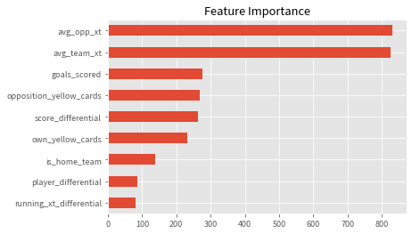
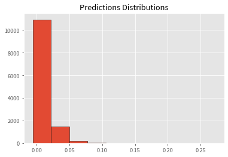
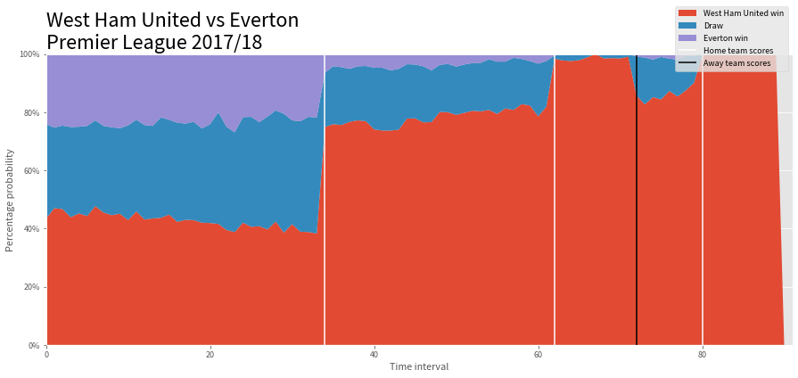

# Building a Win Probability Model in Python

Let's talk about win probability. Along with metrics and graphics like [**attacking threat**](https://www.premierleague.com/news/2210969), [**momentum tracker**](https://www.premierleague.com/news/2129917), it is a part of a whole new slew of analytics-driven content added to the football broadcast experience. In case you aren’t aware what win probability is, it is the set of *percentage numbers shown during matches indicating the expected outcome of the match*. 


I personally like them a lot. To the average viewer, they are fairly easy to understand, quick to digest, and almost always intuitive.

In this blog post, we will look at how to build one of those models. Our job is made easier by the fact that there’s already some existing public work on the topic - [1](https://theanalyst.com/eu/2021/11/live-win-probability/),[2](https://people.cs.kuleuven.be/~pieter.robberechts/repo/robberechts-mlsa19-iwp.pdf),[3](https://www.americansocceranalysis.com/home/2021/7/16/we-have-a-new-win-probability-model) by **StatsPerform**, **KU Leuven**, and **American Soccer Analysis (ASA)** respectively. For this blog post, we will try to implement the one by ASA as the methodology explained by [Tyler Richardett](https://twitter.com/TylerRichardett) was detailed enough while also being simple enough to implement. If you haven’t already, I’d suggest reading through the blog post at least once before coming back here. 

## Implementation

All of the code is on the github repository [here](https://github.com/sharmaabhishekk/ASA-Win-Probability-Model). The data used was the entire of the 2017/18 Premier League season from the public [figshare wyscout data](https://figshare.com/collections/Soccer_match_event_dataset/4415000/2). We need the event data to calculate some metrics like the `game flow` and the pre-match team strength metrics (both calculated using “expected threat” or xT). 

I broke down the code into **three separate notebooks**. They are meant to be run in sequence. The first two notebooks take care of the **preprocessing** and **feature-building** parts while the third one contains the **modelling** and simulation bits. 

### Notebook 1

Before diving into the code, a quick little detour to discuss win probability to ensure we are all on the same page. <span class='highlight-text'>Win probability is basically described as the expected probability of either team winning or a draw at any given game state or even before the match begins.</span> 

Our intuition tells us that a few different factors affect this win probability - like **current scoreline**, **team strengths**, the **flow of the game**, **minutes remaining**, etc. 

Using these factors, we want to estimate the probability of both teams scoring in the remaining minutes. Once we have those, we can use these values to simulate goals, tally them with the current scoreline and get our W/L/D probabilities. This is best explained using an example (picked up directly from the blog):

“*…let’s say FC Tucson leads the Richmond Kickers 2–1 with 40 minutes of play remaining. And based on a number of features detailed below, our model tells us that Tucson has a constant 0.7% probability of scoring across each of those 40 minutes, and that Richmond has a 3.8% probability. So, we flip a weighted coin for 40 trials over 10,000 simulated games, tally those respective results, and find that Tucson wins 2,394 times, the two teams draw another 2,701 times, and Richmond wins 4,905 times. In turn, we predict that the Kickers have a 49% chance of overcoming the 2–1 deficit and winning the game.*”

Here’s the full list of features that we will use to fit our model:

* score_differential
* goals_scored
* player_differential
* own_yellow_cards
* opposition_yellow_cards 
* is_home_team
* avg_team_xt
* avg_opp_xt
* minutes_remaining
* time_interval
* time_intervals_remaining
* running_xt_differential

#### Steps to cover:

1. The data is all in `.json` format. Load it into a pandas dataframe.
2. Separate out the tags dictionary into a usable column.
3. Use tags to find markers like **goals**, **red cards**, **yellow cards**, to get our game state features. 
4. Get xT values for our successful passes.

```python
import json
from glob import glob
import os

import pandas as pd; pd.set_option("display.max_columns", None)
from pandas import json_normalize
import numpy as np
from tqdm import tqdm


WYSCOUT_DATA_FOLDER = "../wyscout_figshare_data" ## path where the wyscout data is extracted
PROCESSED_DATA_FOLDER = "../processed-data" ## where you want to save the processed csv files
EVENTS_FILE_NAME = os.path.join(WYSCOUT_DATA_FOLDER, "events\events_England.json") ## the league which you want to train the model on (Premier League here)
MATCHES_FILE_NAME = os.path.join(WYSCOUT_DATA_FOLDER, "matches\matches_England.json")

##events file
with open(EVENTS_FILE_NAME) as f:
    events = json.load(f)
df = json_normalize(events)
df['tags_list'] = df["tags"].apply(lambda x: [d['id'] for d in x])

##matches file
with open(MATCHES_FILE_NAME) as f:
    matches = json.load(f)
matches_dict = {match['wyId']:match for match in matches} 

##xt file - download from https://karun.in/blog/data/open_xt_12x8_v1.json
with open("../expected_threat.json") as f:
    xtd = np.array(json.load(f))
```

To get out expected threat values, we will be using the raw xt values shared by Karun Singh. The data is already in the github repository if you’re cloning the repo. 

We essentially need xT for three metrics - `avg_team_xt`, `avg_opp_xt`, and `running_xt_differential`. It is also important to know that the *wyscout data only has passes and not carries so we will only have xT values for passes* (it is possible to impute carries from the data by looking at the difference between successive events but for the first run, I decided to skip that).

For the game state metrics - like red cards or goals - we need to use the wyscout tags. The tag ids and their descriptions are in the `tags2name.csv` file from the extracted data. For example, **1702** is a yellow card, **101** is a goal, **102** is an own goal and so on. 

We will loop over all the matches, perform the steps from above, and save them all as `.csv` files in our `processed-data` folder. 

```python
def get_goals(vals, side):
    
    tags, event_name, team_id = vals
    if side == 'home':
        return (101 in tags and team_id == home_team_id) or (102 in tags and team_id == away_team_id) ## 101 is a goal, 102 is an own goal
    elif side == 'away':
        return (101 in tags and team_id == away_team_id) or (102 in tags and team_id == home_team_id)
    
def get_xt_value(vals):
    x1,x2,y1,y2 = vals
    return xtd[y2][x2] - xtd[y1][x1]        

match_ids = sorted(df['matchId'].unique())

for match_id in tqdm(match_ids):
    
    match_df = df.query("matchId == @match_id").copy()
    
    match_md = matches_dict[match_id] ##match meta data

    home_team_id, = [int(key) for key in match_md['teamsData'] if match_md['teamsData'][key]['side'] == 'home']
    away_team_id, = [int(key) for key in match_md['teamsData'] if match_md['teamsData'][key]['side'] == 'away']
    
    ## assign columns
    match_df["home_goals"] = 0
    match_df["away_goals"] = 0
    
    match_df['home_number_of_yellows'] = 0
    match_df['away_number_of_yellows'] = 0

    match_df['home_number_of_players'] = 11
    match_df['away_number_of_players'] = 11
    
    ## get goals
    shots_df = match_df.query("eventName == 'Shot'")
    
    home_goal_idxs = shots_df.loc[shots_df[['tags_list', 'eventName', 'teamId']].apply(get_goals, side='home', axis=1)].index
    away_goal_idxs = shots_df.loc[shots_df[['tags_list', 'eventName', 'teamId']].apply(get_goals, side='away', axis=1)].index
    
    for idx in home_goal_idxs:
        match_df.loc[idx:, "home_goals"] +=1
    for idx in away_goal_idxs:
        match_df.loc[idx:, "away_goals"] +=1
    
    ## get yellow cards
    home_first_yellow_idxs = match_df[match_df[['tags_list', 'teamId']].apply(lambda vals: 1702 in vals[0] and vals[1] == home_team_id, axis=1)].index
    away_first_yellow_idxs = match_df[match_df[['tags_list', 'teamId']].apply(lambda vals: 1702 in vals[0] and vals[1] == away_team_id, axis=1)].index
    
    for idx in home_first_yellow_idxs:
        match_df.loc[idx:, "home_number_of_yellows"] +=1
    for idx in away_first_yellow_idxs:
        match_df.loc[idx:, "away_number_of_yellows"] +=1
    
    ## get red cards
    home_red_idxs = match_df[match_df[['tags_list', 'teamId']].apply(lambda vals: (1701 in vals[0] or 1703 in vals[0]) and vals[1] == home_team_id, axis=1)].index
    away_red_idxs = match_df[match_df[['tags_list', 'teamId']].apply(lambda vals: (1701 in vals[0] or 1703 in vals[0]) and vals[1] == away_team_id, axis=1)].index

    for idx in home_red_idxs:
        match_df.loc[idx:, "home_number_of_players"] -=1
    for idx in away_red_idxs:
        match_df.loc[idx:, "away_number_of_players"] -=1
    
    
    ## get pass xt values
    pass_df = match_df.loc[(match_df['eventName'] == 'Pass') & (match_df['tags_list'].astype(str).str.contains("1801"))].copy()
    pass_df[['x1', 'y1', 'x2', 'y2']] = pd.DataFrame(pass_df['positions'].\
                                apply(lambda data: [data[0]['x'], data[0]['y'], data[1]['x'], data[1]['y']]).\
                                tolist(), index=pass_df.index)

    pass_df['x1_idx'] = np.clip(np.int64(pass_df['x1'].values//(100/12)), a_min=0, a_max=11)
    pass_df['x2_idx'] = np.clip(np.int64(pass_df['x2'].values//(100/12)), a_min=0, a_max=11)
    
    pass_df['y1_idx'] = np.clip(np.int64(pass_df['y1'].values//(100/8)), a_min=0, a_max=7)
    pass_df['y2_idx'] = np.clip(np.int64(pass_df['y2'].values//(100/8)), a_min=0, a_max=7)
    pass_df['xt_value'] = pass_df[['x1_idx','x2_idx','y1_idx','y2_idx']].apply(get_xt_value, axis=1)

    match_df.loc[pass_df.index, "xt_value"] = pass_df['xt_value']
    
    ##save 
    filename = os.path.join(PROCESSED_DATA_FOLDER, f"{match_id}_{home_team_id}_{away_team_id}.csv")
    match_df.to_csv(filename, index=False)    
```

### Notebook 2

#### Main steps to cover:

1. Aggregate n-previous xt values for both teams from every match to get our pre-match team strength metrics.
2. Calculate `rolling xT difference` per minute (game flow proxy).
3. Get `remaining minutes` and `time intervals`.
4. Derive the <span class='highlight-text'>target</span> - probability of scoring in the remaining minutes.

In this notebook, we will use the processed csv file for each match and build the remaining features. For our team strength indicators, we will take an average of the xt accumulated by the teams in their last 4 matches. To do this, an efficient (if not the most elegant) way is to first loop over all matches, calculate the xt accumulated by both teams and then save the result in a JSON file. 

```python
files = glob(r"../processed-data/*.csv")
match_ids = [file.split("\\")[-1].split(".csv")[0].split("_")[0] for file in files]
home_team_ids = [file.split("\\")[-1].split(".csv")[0].split("_")[1] for file in files]
away_team_ids = [file.split("\\")[-1].split(".csv")[0].split("_")[2] for file in files]

all_team_match_files_dict = {}
for team_id in sorted(list(set(home_team_ids))):
    all_team_match_files_dict[team_id] = [file for file in files if team_id in file]

n_prev_matches = 4
create_xt_matches = True
n_matches = 38
```
This is what was done in the following code cell. 

```python
xt_matches_dict = {}
if create_xt_matches:
    for file, match_id, home_team_id, away_team_id in tqdm(zip(files, match_ids, home_team_ids, away_team_ids)):
        d = pd.read_csv(file)
        grouped_xt_df = d.query("xt_value >= 0").groupby("teamId").agg(sum_fwd_xt= ("xt_value", "sum")).reset_index()
        xt_matches_dict[match_id] = dict(zip(grouped_xt_df.teamId.astype(str), grouped_xt_df.sum_fwd_xt))
    with open("../pre_xt_matches.json", "w") as f:
        json.dump(xt_matches_dict, f)
else:
    with open("../pre_xt_matches.json") as f:
        xt_matches_dict = json.load(f)

```

After this, we again loop over all the matches, and build the remaining features. Note that the `time intervals` here comes from the blog post itself where Tyler had divided each match into 100 total intervals - this helps to deal with the variable gametime for each match. 

```python
cols = ["matchId", 
        "teamId", 
        "score_differential", 
        "goals_scored",
        "player_differential", 
        "own_yellow_cards", 
        "opposition_yellow_cards", 
        "is_home_team", 
        "avg_team_xt",
        "avg_opp_xt",
        "minutes_remaining",
        "time_interval",
        "time_intervals_remaining",
        "running_xt_differential",
        "scored_goal_after" ##target
       ]

def get_running_xt(args):
    """ get xt difference for every minute of the match. """
    team_id, minute = args
    if team_id == home_team_id:
        return home_away_running_xt_dict[minute]
    else:
        return -home_away_running_xt_dict[minute] if home_away_running_xt_dict[minute] != 0 else 0    
    
def get_running_xt_differential(vals):
    """ calculate the xt difference b/w both teams in the last 10 minutes of the match. Essentially a proxy for game flow"""
    n_minutes_period = 10
    team_id, minute, match_period = vals
    return pdf.query("matchPeriod == @match_period & teamId == @team_id & (@minute-@n_minutes_period<=minutes_round<=@minute)")["minute_xt_difference"].mean()

data = []
for file, match_id, home_team_id, away_team_id in tqdm(zip(files, match_ids, home_team_ids, away_team_ids)):
    
    home_file_idx = all_team_match_files_dict[home_team_id].index(file)
    away_file_idx = all_team_match_files_dict[away_team_id].index(file)
    
    if home_file_idx >=4 and away_file_idx >= 4:
    
        home_xt_files = all_team_match_files_dict[home_team_id][home_file_idx - n_prev_matches: home_file_idx]
        away_xt_files = all_team_match_files_dict[away_team_id][away_file_idx - n_prev_matches: away_file_idx]

        home_vals = []
        for home_xt_file in home_xt_files:
            hmid = home_xt_file.split("_")[0].split("\\")[-1]
            home_vals.append(xt_matches_dict[hmid][home_team_id])

        away_vals = []
        for away_xt_file in away_xt_files:
            amid = away_xt_file.split("_")[0].split("\\")[-1]
            away_vals.append(xt_matches_dict[amid][away_team_id])

        pre_home_avg_xt_value = np.mean(home_vals)
        pre_away_avg_xt_value = np.mean(away_vals)

        home_team_id = int(home_team_id)
        away_team_id = int(away_team_id)

        df = pd.read_csv(file)

        ## minutes remaining
        df["minutes"] = df["eventSec"]/60
        df["minutes_round"] = df["minutes"].astype(int)
        h1_last_minute = df.query("matchPeriod == '1H'").minutes_round.max()
        h2_last_minute = df.query("matchPeriod == '2H'").minutes_round.max()

        ##running xt differential
        pdfs = []
        for period in ["1H", "2H"]:
            pdf = df.query("matchPeriod == @period").copy()
            p = pdf.groupby(["teamId", "minutes_round"]).\
                agg(xt=("xt_value", "sum")).\
                reset_index().\
                pivot(index="minutes_round", columns="teamId", values="xt").fillna(0)
            home_away_running_xt_dict = dict(zip(p.index, p[home_team_id] - p[away_team_id]))

            pdf["minute_xt_difference"] = pdf[['teamId', 'minutes_round']].apply(get_running_xt, axis=1)
            pdf["running_xt_differential"] = pdf["minute_xt_difference"].rolling(10).mean().fillna(0)

            if period == "1H":
                pdf["minutes_remaining"] = pdf['minutes_round'].apply(lambda minute: (h1_last_minute - minute) + h2_last_minute)
            else:
                pdf["minutes_remaining"] = pdf['minutes_round'].apply(lambda minute: h2_last_minute - minute)

            pdfs.append(pdf)
        df = pd.concat(pdfs, ignore_index=False)
        df['time_interval'] = 100 - pd.cut(df["minutes_remaining"], bins=100, labels=False) ## time intervals comes directly from the blog
        df['time_intervals_remaining'] = 100 - df['time_interval']
        df['score_differential'] = np.where(df["teamId"] == home_team_id, 
                                            df['home_goals']-df['away_goals'], 
                                            df['away_goals']-df['home_goals'])

        df['goals_scored'] = np.where(df["teamId"] == home_team_id, 
                                      df['home_goals'], 
                                      df['away_goals'])

        df['player_differential'] = np.where(df["teamId"] == home_team_id, 
                                             df['home_number_of_players']-df['away_number_of_players'], 
                                             df['away_number_of_players']-df['home_number_of_players'])

        df['own_yellow_cards'] = np.where(df["teamId"] == home_team_id, 
                                          df['home_number_of_yellows'], 
                                          df['away_number_of_yellows'])

        df['opposition_yellow_cards'] = np.where(df["teamId"] == home_team_id, 
                                                 df['away_number_of_yellows'], 
                                                 df['home_number_of_yellows'])

        df['is_home_team'] = np.where(df["teamId"] == home_team_id, 1, 0)

        df['avg_team_xt'] = np.where(df["teamId"] == home_team_id, pre_home_avg_xt_value, pre_away_avg_xt_value)
        df['avg_opp_xt'] = np.where(df["teamId"] == home_team_id, pre_away_avg_xt_value, pre_home_avg_xt_value)


        ##
        ## target - goals scored after        
        df["home_num_goals_scored_after"] = df['home_goals'].max()
        df["home_num_goals_scored_after"] = df["home_num_goals_scored_after"] - df["home_goals"]
        
        df["away_num_goals_scored_after"] = df['away_goals'].max()
        df["away_num_goals_scored_after"] = df["away_num_goals_scored_after"] - df["away_goals"]


        df['scored_goal_after'] = np.where(df["teamId"] == home_team_id, df['home_num_goals_scored_after'], df['away_num_goals_scored_after'])
        df["scored_goal_after"] = df["scored_goal_after"]/df["time_intervals_remaining"]
        
        ##save 
        data.append(df.fillna(0))        
```
Our target variable is the probability of scoring the goals in the remaining time intervals. I had initially only used a <span class="highlight-text">binary outcome variable</span> (whether a goal was scored or not after this stage) but Tyler himself explained a better way to do this - which would be just the number of goals remaining to be scored divided by the number of intervals left.

> To illustrate using an example, if we are in the time interval 60/100, and we know FC Tucson are going to score another 2 goals in the remaining time intervals, the probability at that point would be `2/40` or `0.05`. If they score 1 at 65, then at 70/100 it would be `0.034` (`1/30`). 

(Per my earlier understanding, the binary target variable at time interval 60 would be 1 - indicating that “*yes, they do score a goal after this stage*” and would continue to be 1 until they have scored both their remaining goals, at which stage it would become 0 - indicating that no further goals were scored after that interval)

After finishing all our steps for all our matches, we saved the data as one large `.csv` file and proceed onto the exciting stuff - modelling. 

```python
final_df = pd.concat(data, ignore_index=True)
final_df.to_csv("../final_processed_data.csv", index=False) 
```

### Notebook 3

#### Main steps to cover:

1. Group the data from the previous notebook so that we have a single observation per minute.
2. Split the data and fit the model.
3. Some evaluation graphs and a sanity check plot.

```python
import json
import os
from glob import glob

import pandas as pd
import numpy as np
import matplotlib.pyplot as plt; plt.style.use("custom_ggplot")
import matplotlib.ticker as mtick
from tqdm import tqdm

import lightgbm as lgb
from sklearn.model_selection import train_test_split
```

The blog uses a single observation per minute of the match. Our final data from the previous notebook has multiple records per minute so our first step is to perform a `pandas groupby` and condense the data. After performing that, we have around 60k observations in total. 

```python
WYSCOUT_DATA_FOLDER = "../wyscout_figshare_data" ## path where the wyscout data is extracted

df = pd.read_csv("../final_processed_data.csv")

with open(os.path.join(WYSCOUT_DATA_FOLDER, 'teams.json')) as f:
    teams_meta = json.load(f)
team_names_dict = {t['wyId']:t['name'] for t in teams_meta}

p = df.groupby(["matchId", "teamId", "minutes_remaining"]).agg(
    score_differential =("score_differential", "last"), 
    goals_scored = ("goals_scored", "last"), 
    player_differential = ("player_differential", "last"), 
    own_yellow_cards = ("own_yellow_cards", "last"), 
    opposition_yellow_cards = ("opposition_yellow_cards", "last"), 
    is_home_team = ("is_home_team", "last"), 
    avg_team_xt = ("avg_team_xt", "last"), 
    avg_opp_xt = ("avg_opp_xt", "last"), 
    running_xt_differential = ("running_xt_differential", "mean"), 
    scored_goal_after = ("scored_goal_after", "last"), 
    time_interval=('time_interval', 'last')
).reset_index().sort_values(['matchId', 'time_interval'])

print(df.shape)
print(p.shape)
```
At this point we are pretty much ready to fit a first model. We batch out our train and test splits and fit a regression model. 

> Notice that the `time interval` column is not a part of the feature set - the model predictions seem to be more consistent without it. I suspect that’s because of the target leakage and that ends up hindering the model’s ability to learn useful relations. For this reason, I decided to remove it from the feature set. It wasn’t present in ASA’s model either. At any rate, we will really need it immediately after to simulate the final outcomes. 

```python
holdout_match_ids = [2500098]

cols =  [
    'goals_scored',
    'player_differential', 
    'own_yellow_cards', 
    'opposition_yellow_cards', 
    'is_home_team',
    'avg_team_xt', 
    'avg_opp_xt', 
    'time_interval', 
    'running_xt_differential',
    'score_differential'
]

features = [
    'goals_scored',
    'player_differential', 
    'own_yellow_cards', 
    'opposition_yellow_cards', 
    'is_home_team',
    'avg_team_xt', 
    'avg_opp_xt', 
    'running_xt_differential',
    'score_differential'
]

target = 'scored_goal_after'

X_train, X_test, y_train, y_test = train_test_split(p.query("matchId != @holdout_match_ids")[cols], 
                                                    p.query("matchId != @holdout_match_ids")[target], 
                                                    test_size=0.2, random_state=42
                                                   )
model = lgb.LGBMRegressor()
model.fit(X_train[features], y_train, 
          eval_set=[(X_test[features], y_test)], early_stopping_rounds=200, 
          verbose=20
         )
predictions = model.predict(X_test[features])
```

```python
(pd.Series(model.feature_importances_, index=features)
 .sort_values()
   .plot(kind='barh', title='Feature Importance'));
```


```python
plt.hist(model.predict(X_test[features]), ec='k') 
plt.title('Predictions Distributions');
```


#### Simulation

For a given match, once we have a goal-scoring probability for each time interval, we can ‘flip a weighted coin and tally the results'. Once we get our tallies for all the time intervals, we can draw a stack plot to visually get an idea of the model’s performance. 

```python
n_sims = 1000 ## number of simulations for each remaining time interval
fig, axes = plt.subplots(figsize=(15, 6), sharey=True)

for holdout_match_id, ax in zip(holdout_match_ids, [axes]):
    holdout = p.query("matchId == @holdout_match_id").copy()
    holdout["team_scoring_prob"] = model.predict(holdout[features])

    home_team_id = holdout.query("is_home_team == 1").teamId.unique()[0]
    away_team_id = holdout.query("is_home_team == 0").teamId.unique()[0]
    h = holdout.pivot_table(index='time_interval', 
                            columns='teamId', 
                            values=['team_scoring_prob', 'score_differential']).reset_index()
    h.columns = [a+"_"+str(b) for (a,b) in h.columns]
    h = h.reset_index(drop=True)
    
    for idx in h[h.isnull().any(axis=1)].index:
        if h.loc[idx, f"score_differential_{home_team_id}"] != h.loc[idx, f"score_differential_{home_team_id}"]:
            h.loc[idx, f"score_differential_{home_team_id}"] = -h.loc[idx, f"score_differential_{away_team_id}"]
            
        elif h.loc[idx, f"score_differential_{away_team_id}"] != h.loc[idx, f"score_differential_{away_team_id}"]:
            h.loc[idx, f"score_differential_{away_team_id}"] = -h.loc[idx, f"score_differential_{home_team_id}"]
            
    h = h.fillna(0)
    home_wins_list = []
    away_wins_list = []
    draws_list = []

    for time_interval, hsd, asd, h_prob, a_prob in zip(h["time_interval_"], 
                                               h[f"score_differential_{home_team_id}"], 
                                               h[f"score_differential_{away_team_id}"], 
                                               h[f"team_scoring_prob_{home_team_id}"], 
                                               h[f"team_scoring_prob_{away_team_id}"]):
        if time_interval != 100:

            home_goals_sim = np.random.binomial(100-time_interval, h_prob, n_sims)
            away_goals_sim = np.random.binomial(100-time_interval, a_prob, n_sims)
            
            home_sd_sim = hsd + (home_goals_sim - away_goals_sim)

            home_wins = np.sum(home_sd_sim > 0)
            away_wins = np.sum(home_sd_sim < 0)
            draws = np.sum(home_sd_sim == 0)

            home_wins_list.append((home_wins/n_sims)*100)
            away_wins_list.append((away_wins/n_sims)*100)
            draws_list.append((draws/n_sims)*100)
            
        else:
            
            home_wins_list.append(0)
            away_wins_list.append(0)
            draws_list.append(0)

    y = np.vstack([home_wins_list, draws_list, away_wins_list])
    
    ax.stackplot(range(len(home_wins_list)), 
                 y, 
                 labels=[f"{team_names_dict[home_team_id]} win", "Draw", f"{team_names_dict[away_team_id]} win"]
                )
    ax.yaxis.set_major_formatter(mtick.PercentFormatter())
    
    draw_home_goals = draw_away_goals = True
    for (idx, val) in h.loc[(h[f"score_differential_{home_team_id}"].diff()!=0), f"score_differential_{home_team_id}"].diff().dropna().iteritems():
        if val == 1:
            if draw_home_goals:
                draw_home_goals = False
                hlabel = "Home team scores"
            else:
                hlabel = None
            ax.vlines(idx, 0, 100, color=['white'], label=hlabel)
        elif val == -1:
            if draw_away_goals:
                alabel = "Away team scores"
                draw_away_goals = False
            else:
                alabel = None
            ax.vlines(idx, 0, 100, color=['black'], label=alabel)
    
    ## plot cosmetics
    
    ax.set(xlabel = "Time interval", 
           ylabel= "Percentage probability",
           xlim=(0, len(home_wins_list)),
           ylim=(0, 100)
          )
    
    ax.title.set(text=f"{team_names_dict[home_team_id]} vs {team_names_dict[away_team_id]}\nPremier League 2017/18",
                 fontsize=24, x=0, ha='left')

    ax.legend(loc=1, 
             bbox_to_anchor=(0.8, 0.98, 0.2, 0.2));
    # fig.savefig('test', dpi=200)

fig
``` 


## Limitations

Some present limitations with the methodology and some potential model improvement ideas.

##### Figuring out a better validation and evaluation strategy

One of the things I glossed over was the evaluation metric used in the blog - <span class="highlight-text">Ranked Probability Score (RPS)</span>. It was ideal for evaluating models predicting match results where there’s any notion of win, draw, or loss. While I was successful in implementing the loss function, I couldn’t manage to use it as a custom function while training the model. It is important to note that without this, we have no real way of knowing if the model we just trained is good or bad besides simply plotting the graphs from above and visually checking. LightGBM uses <span class="highlight-text">l2 loss</span> by default for regression but it is not ideal for our case. 

##### Training on more data 

Also, we just trained the model on just one season of the Premier League. Probably the best way to improve the performance is to simply train it for the remaining seasons for the other leagues as well in the wyscout dataset. Tyler told me that they used a total of 7500 matches to train their final model - so it is very likely there’s some model performance that we’re leaving on the table by training on only 340 matches!

##### Getting xT for carries or using an action-valuing model like VAEP or g+

One final way of improving the model performance is using **g+** or some other action-valuing model instead of a ball progression model like **xT**. The team strength indicators are very important to the model’s performance as noted by the feature importance plot from above so using a more granular action-valuing model might further tune the model predictions. 

----------
Huge thanks to Tyler Richardett himself for his post which inspired this entirely as well as helping me with all my questions. Big thanks also to [Sushruta Nandy](https://twitter.com/lemonhoneytea_) (again!) and [Will Savage](https://twitter.com/ScoutedSxv) for reading the first draft! 

--------

**[GITHUB PROJECT REPO LINK](https://github.com/sharmaabhishekk/ASA-Win-Probability-Model)**