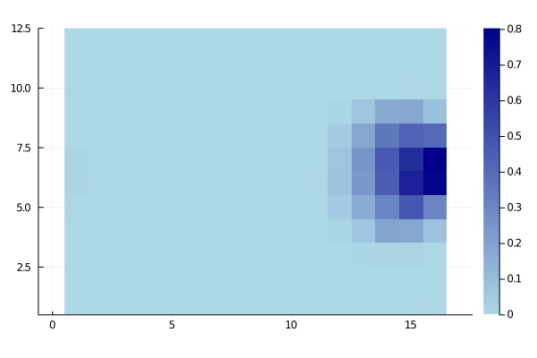
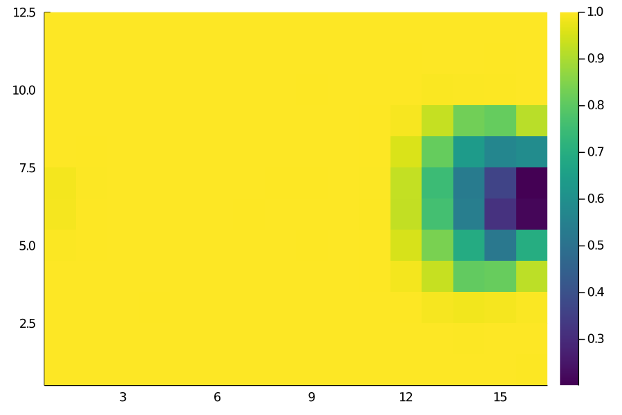
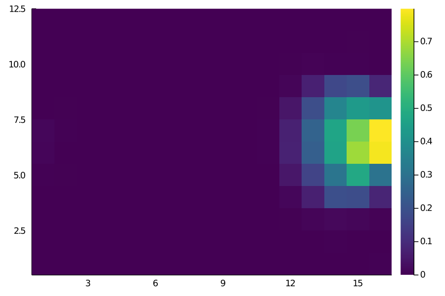
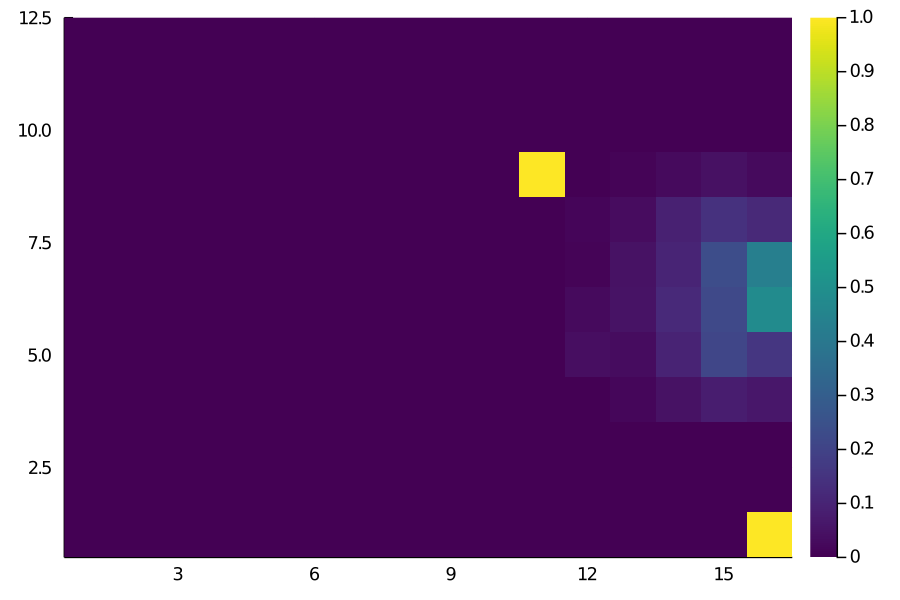
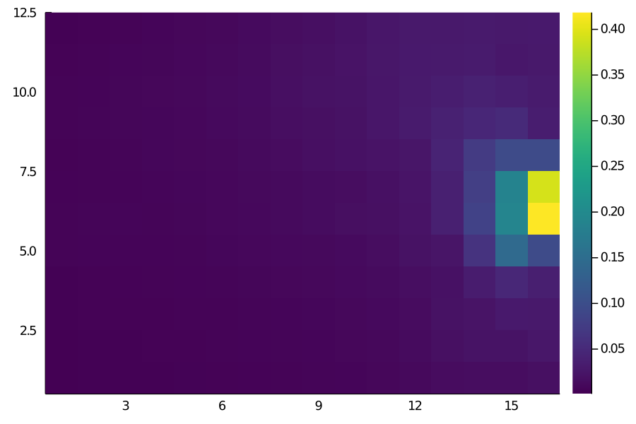

# Implementing Expected Threat (xT) in Julia

Expected Threat (or xT) is one of the coolest ideas to come up in the football analytics sphere in the last few years. Originally introduced by [Karun Singh](https://twitter.com/karun1710) in this [post](https://karun.in/blog/expected-threat.html), it is essentially a ball progression model. That is, it provides us with a framework to value any ball moving action in terms of how likely it is to result in a goal in the next *n* actions (where a good *n* value is typically 4-5). 

Karun has made his xT data available [here](https://karun.in/blog/data/open_xt_12x8_v1.json) and there already exists a python implementation of xT [here](https://github.com/ML-KULeuven/socceraction/blob/master/socceraction/xthreat.py). So why implement it again? My main motivation to do this is to not only show the code but also explain it a little; try to get into the inner workings of xT and hopefully go over the entire process of converting a raw event data stream to a finished model together. 

Let's dive in!


## Prerequisites

Assuming you already have Julia installed (I'm currently on version 1.5.2), you'll need the following external libraries

* Plots
* DataFrames
* CSV
* StatsBase

Installing libraries in Julia is fairly simple using the **`Pkg`** library. For example, to install the library **Plots**, just run the following command at the Julia console: 

```julia
import Pkg
Pkg.add("Plots")
``` 

## Dataset

The dataset we're going to use is the entire last season of Premier League (2019/20). The data is already converted to the SPADL format. If that's a new word to you, SPADL is just an attempt to standardize all the different data providers like Wyscout, Statsbomb, Opta, Instat to a single format. I'm personally a big fan as it makes it much easier to work with event data since your work becomes transferable across different data providers (for more details, go [here](https://github.com/TomDecroos/atomic-spadl#1-conversion-from-event-stream-format-to-spadl)). The **`CSV`** file is [here](https://github.com/sharmaabhishekk/random_stuff/blob/master/xt_derivation_julia/xt_pre_data.csv). If you're following along with the code, download it and place it in the same folder as your notebook. 

## Getting Started

### The Formula

The final equation as well as the intuition behind it is very well described by Karun in his post. To quote the relevant parts:

> Let $V_{x,y}$ be the "value" that our algorithm assigns to zone $(x,y)$. Now imagine you have the ball at your feet in zone $(x,y)$. You have two choices: shoot, or move the ball. Based on past data, we know that whenever you shoot from here, you will score with probability $g_{x, y}$. Thus, if you shoot, your expected pay-off is $g_{x,y}$.

> Or, you can opt to move the ball via a pass to a teammate or by dribbling it yourself. But there's another choice to make here: which of the 192 zones should you move it to? Say you choose to move the ball to some new zone, $(z, w)$. In this case, your expected pay-off is the value at zone,$(z, w)$, i.e. $V_{z, w}$. But this was just one of the 192 choices that you had; how can we compute the expected pay-off for all of the 192 choices in totality? Here's where the move transition matrix $T_{x,y}$ comes in: based on past data, we know where you're likely to move the ball to whenever you're in zone $(x, y)$, so we can proportionally weight the pay-offs from each of the 192 zones. Specifically, for each zone $(z, w)$, the pay-off is $T_{(x,y)\rightarrow(z,w)} \times V_{z,w}$, i.e. the probability of moving to that zone times the reward from that zone. To get the total expected pay-off for moving the ball, we must sum this quantity over all possible zones:

> $\sum_{z=1}^{16} \sum_{w=1}^{12} T_{(x,y)\rightarrow(z,w)} \times V_{z,w} $

> Finally, let's piece it all together. We computed the pay-off if you shoot as $g_{x, y}$, and the pay-off if you move the ball as 
$\sum_{z=1}^{16} \sum_{w=1}^{12} T_{(x,y)\rightarrow(z,w)} \times V_{z,w}$. Based on past data, we know that you tend to shoot $s_{x,y}$ percent of the time, and you opt to move the ball $m_{x,y}$ percent of the time. Therefore, let's weight these two outcomes based on the probability of each of them happening, to obtain our final value for zone $(x, y)$:

> $V_{x,y} = (s_{x,y} \times g_{x,y}) + (m_{x,y} \times \sum_{z=1}^{16} \sum_{w=1}^{12} T_{(x,y)\rightarrow(z,w)} V_{z,w})$


### Codifying the Problem

[**Note**: *In the original post, Karun has divided the pitch into 16x12 grids. For this post, we'll use the same dimensions*]

So basically, we can divide the xT equation into **two parts** - the part concerned with **scoring** and the part concerned with **moving**. Summing those together, we get the xT for any location on the pitch. The xT for an action would then just be the **difference between the values at the end location and the start location**. Discussing those two parts separately further:

1. The first part - **scoring** - is just the probability of taking a shot from a certain location times the probability of the shot resulting in a goal. 

2. The second part - **moving** - broken down further: 

    1. The **move probability** is just the probability of moving from any location. 

    2. But there are a total of 192 (16x12) possible locations to move to as well. So what we need to do is, for every given location, calculate the probability of moving to all other locations times the inherent value at those locations. This is the **transition matrix**. We combine all those up and multiplying with the move probability concludes step 2. 

There's another bit that we need to worry about. The problem statement inherently produces a cyclic dependency since calculating the value at a zone assumes that we already know the values at other zones. The solution to this is to **perform the xT calculation iteratively**. Luckily, this is what for loops exist for and for our purposes, we can simple put the entire thing in a loop. And how many iterations do we run it for? Karun himself has suggested 4-5 iterations for sufficient convergence in his original post, but we can set a threshold and check against our own dataset. 

To summarize, all that we need from our data wrangling session is the four inputs for our xT function: 

* ***scoring_probability_matrix*** (shape = *(12,16)*)
* ***shooting_probability_matrix*** (shape = *(12, 16)*)
* ***move_probability_matrix*** (shape = *(12, 16)*)
* ***transition_matrix*** (shape = *(192, 192)*)

The first three are all very similar. They all have the same shape (width times length) and are essentially just counts of certain actions divided by total actions in the cell. 
To make sure we're on the same page, here's how you might expect the `shooting_probability_matrix` to *look* like:



### Data preprocessing

```julia

##imports
using Plots

using DataFrames
using CSV
using StatsBase
```
And defining our field length and width parameters

```julia

##params
l = 16
w = 12
xts = Any[];
```
Next, let's read in our dataset.

```julia
df = DataFrame(CSV.File("xt_pre_data.csv"))
```

If you run **`head(df)`**, you'll see the following output:

```
6 rows × 25 columns (omitted printing of 17 columns)

|   | team_id |               player_name | start_x | start_y |   end_x |   end_y | type_name |
|--:|--------:|--------------------------:|--------:|--------:|--------:|--------:|-----------|
|   |   Int64 |                    String | Float64 | Float64 | Float64 | Float64 |    String |
| 1 |      13 | Pierre-Emerick Aubameyang |  52.605 |  33.796 |    44.1 |  34.748 |      pass |
| 2 |      13 |              Granit Xhaka |    44.1 |  34.748 |   44.52 |  33.116 |   dribble |
| 3 |      13 |          Matteo Guendouzi |  39.585 |   24.82 |   41.58 |  23.256 |   dribble |
| 4 |      13 |              Granit Xhaka |   44.52 |  33.116 |  39.585 |   24.82 |      pass |
| 5 |      13 |              Nicolas Pépé |  49.665 |   21.76 |   45.57 |  20.876 |   dribble |
| 6 |      13 |          Matteo Guendouzi |   41.58 |  23.256 |  49.665 |   21.76 |      pass |
```
#### Binning and Counting 

To create our matrices in python, I would've used a simple groupby function to bin the (x,y) locations of our data. In Julia, we can get the same result with these two custom functions.

```julia
function get_bins(values, n_bins, max_lim)
    """ Bin our data into discrete categories 
    #Arguments:
      values: array of values to bin
      n_bins: number of bins
      max_lim: The maximum limit (105 for length; 68 for width)
    #Returns:
      indices
    """
    idx = Int8.(values.÷(max_lim/n_bins) .+ 1)
    idx[findall(idx -> idx>n_bins, idx)] .= n_bins
    idx
end
```
To our `get_bins` function, we provide a vector of `values`, an integer `n_bins`, and a `max_lim`(depending on the x or y axis) and it returns the resulting bin for each value. 

```julia
function get_matrix(df)
    """ returns our matrix of action counts from the dataframe
    #Arguments:
      df: the dataframe of actions
    #Returns:
      matrix: of shape (w, l)  
    """
    df[!, :start_x_bin] = get_bins(df[!, :start_x], l, 105)
    df[!, :start_y_bin] = get_bins(df[!, :start_y], w, 68)
    
    gdf = combine(groupby(df, [:start_x_bin, :start_y_bin]), nrow => :count);
    
    matrix = zeros(w, l)
    for a in eachrow(gdf)
        matrix[a.start_y_bin, a.start_x_bin] = a.count
    end
    matrix
end
```
The `get_matrix` function gives us the (12x16) matrix of counts for all the actions in the dataframe that we pass to it. 

--------

```julia

##calling our functions and getting our matrices
shot_matrix = get_matrix(df[df["type_name"] .== "shot", :])
goal_matrix = get_matrix(df[(df["type_name"] .== "shot") .& (df["result_name"] .== "success"), :])
move_matrix = get_matrix(df[in.(df["type_name"], Ref(["dribble", "pass", "cross"])), :])

total_matrix = move_matrix + shot_matrix
move_matrix = move_matrix ./ total_matrix
score_matrix = goal_matrix ./ shot_matrix; replace!(score_matrix, NaN=>0) ##replacing because 0/0 gives us NaNs
shot_matrix = shot_matrix ./ total_matrix;
```

We first call **`get_matrix`** on all actions which are **shots**. Then we call it on all shots which are successful i.e., all **goals**. A simple Hadamard division of those two give us the average scoring probability matrix - `score_matrix` - in each of our 192 bins. 

The `move_matrix` returns to us the count of all move actions from our grids. We sum it with our `shot_matrix` to get our `total_matrix`.  

[**Note**: *We're working under the assumption that from any grid, the only options you have are to **move** the ball or **shoot** the ball. That is, the $P_m + P_s = 1$.*]

After that, we divide both our `move_matrix` and the `shot_matrix` from the `total_matrix` to get our probability values.  

At the end of all that, we finally have our `move_matrix`, `shot_matrix`, and `score_matrix`. We could try plotting them to see if the values *look* sensible. 

```julia
heatmap(move_matrix, color=:viridis, aspect=1)
```









The results look more or less as we'd expect. For instance, the probability of moving the ball is pretty much close to 1 everywhere deeper but decreases as we get closer to the opposition goal. 

(*In case anyone's wondering, the single yellow grid in the **Score Matrix** is actually [this](https://youtu.be/lYbNYsrl2d4?t=98) goal by Scott McTominay from last season's derby win against Manchester City.*)

#### Calculating the Transition Matrix

The transition matrix contains a single value representing the probability of how likely it is to *successfully* move from a given grid to all of the other 191 grid zones. It is kind of like a **lookup table for all possible combinations of move possibilities.** 

```julia
get_flat_idx(xs, ys, l) = Int16.(((l .* ys) .+ xs) .- l)

function get_transition_matrix(df)
    """Calculate the transition_matrix
    #Arguments: 
      The dataframe of move_actions
    #Returns:
      transition_matrix (shape=(w*l, w*l))   
    """
	trans_matrix = zeros(w*l, w*l)
	for i in 1:w*l
	    vc2 = countmap(df[(df["start_flat_idx"] .== i) , :]["end_flat_idx"])
	    for (key, value) in vc2
	        trans_matrix[i, key] = value/vals[i]
	    end
	end
	trans_matrix
end
```
```julia

df[!, :start_x_bin] = get_bins(df[!, :start_x], l, 105)
df[!, :start_y_bin] = get_bins(df[!, :start_y], w, 68)

df[!, :end_x_bin] = get_bins(df[!, :end_x], l, 105)
df[!, :end_y_bin] = get_bins(df[!, :end_y], w, 68)

##
df[!, "start_flat_idx"] = get_flat_idx(df["start_x_bin"], df["start_y_bin"], l)
df[!, "end_flat_idx"] = get_flat_idx(df["end_x_bin"], df["end_y_bin"], l)

##
vals = get_matrix(df[in.(df["type_name"], Ref(["dribble", "pass", "cross"])), :])
vals = vec(reverse(vals, dims=1)')

succ_move_actions = df[in.(df["type_name"], Ref(["dribble", "pass", "cross"])) .& (df["result_name"] .== "success"), :]
trans_matrix = get_transition_matrix(succ_move_actions);
``` 

### Calculating Expected Threat

Now we finally have our four input matrices. Calculating the xT is mostly just a bunch of matrix manipulation steps.

```julia
function expected_threat(p_scoring, p_shot, p_move, transition_matrix)
    
    """Solves the expected threat equation with dynamic programming.

    Parameters
    ----------
    p_scoring (shape(w, l)):
        Probability of scoring at each grid cell, when shooting from that cell.

    p_shot (shape(w,l)):
        For each grid cell, the probability of choosing to shoot from there.

    p_move (shape(w,l)):
        For each grid cell, the probability of choosing to move from there.

    transition_matrix (shape(w*l,w*l)):
        When moving, the probability of moving to each of the other zones.
    """
    
    xT = zeros(w, l)
    eps = 1e-5
    gs = p_scoring .* p_shot ##element-wise/hadamard product
    it = 0
    diff = 1 

    while length(findall(diff-> diff .> eps, diff)) > 0 ###checking if the change in any of the cell is greater than our threshold
        total_pay-off = zeros(w, l)

        for y in 0:w-1
            for x in 0:l-1
                ##for each zone, calculate the probability of moving to all other zones times the xT at those zones
                for q in 0:w-1
                    for z in 0:l-1
                        total_pay-off[y+1, x+1] += transition_matrix[(l*y + x)+1, (l*q + z)+1] * xT[q+1, z+1]
                    end
                end
            end
        end
        
        push!(xts, xT)
        newxT = gs + (p_move .* total_pay-off) ##the actual xt equation for the pay-off
        diff = newxT - xT
        xT = newxT
        it+=1
        
    end
    println("Total iterations to convergence: ", it)
    xT
end
```   

We can now call this function on our inputs and it should return the 12x16 matrix of xT values. We could try to plot it to check if it looks anything similar to what you'd expect.

```julia
xt = expected_threat(score_matrix, shot_matrix, move_matrix, trans_matrix);
heatmap(xt, color=:viridis, aspect=1)
```


The values looks pretty accurate to me - for example, the grids closest to the goal have a xT value of roughly 0.4 i.e., there's a 40% chance of goal within the next few moves. One clearly visible issue with this is the **left/right imbalance**. That's really due to our dataset - some players are affecting the calculations more than average. It might be a good idea to **manually make it symmetrical** along the length axis. Nonetheless, it looks like a close enough estimate that I can call this implementation a success. 

## Final Word

Hopefully, this post was useful in shedding *some* light into the inner mechanics of xT. We've not talked about the speed gains that Julia provides over Python and with reason; It isn't really relevant as you'd not be running the derivation every time you use xT. But just to mention it: with proper typing and some more optimization, the `expected_threat` function runs roughly **30 times faster** than the same thing in Python (using good old numpy). 

There are caveats, obviously. I'm almost certain there are ways to vectorize the 4 X nested for-loops. I'm also certain that using something like *PyTorch* or *JIT* for the tensor manipulations is going to speed it up even further such that we get comparable speeds to Julia. 

--------

All of the code to reproduce the results are in this notebook [here](https://github.com/sharmaabhishekk/random_stuff/blob/master/xt_derivation_julia/julia_impl_xt.ipynb). Huge thanks to ***Karun*** for the inspiration for this and for explaining things so well in his original blog post. Also huge credit to the open-source xT implementation by the ***KU-Leuven*** people; a lot of my code is a straight-up copy of their python stuff. 

For any kind of feedback(suggestions/questions) about this post or the code, feel free to reach out to me on Twitter or drop me a mail(the former is always faster).


